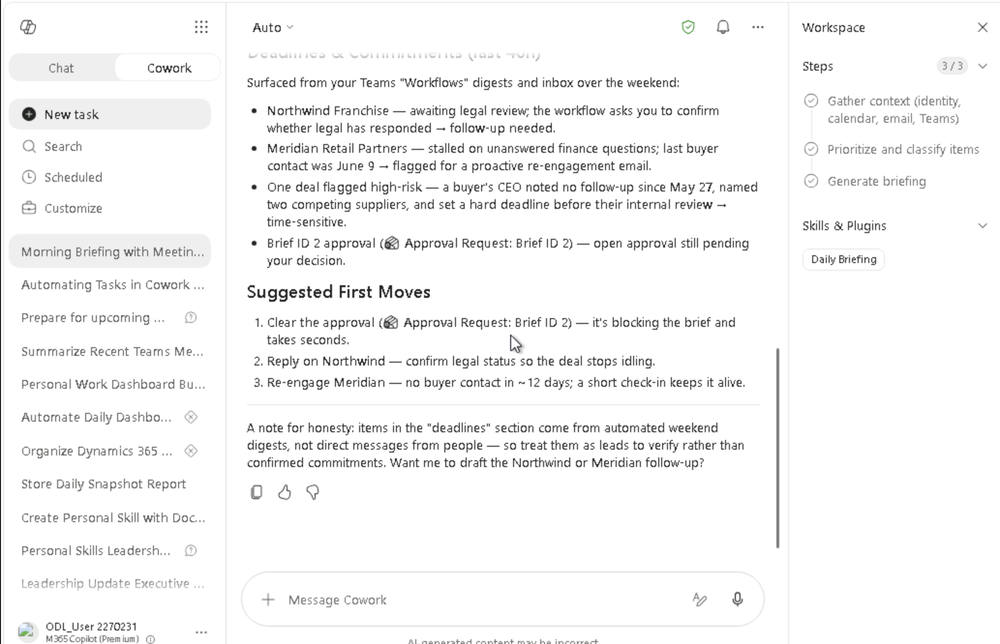

########## Lab 2: Daily Workday Assistant

[TABLE]

[TABLE]

[TABLE]

[TABLE]

#################### Exercise 1 Prepare a Personalized Workday Briefing

*Skills used: Daily Briefing — gathers calendar events, email summaries,
and Teams commitments in one pass*

In this exercise you will write your first multi-source prompt, asking
Cowork to pull together everything you need to start your day in under
two minutes.

############################## Step 1 — Sign in and open Cowork

1.  Open your browser and navigate to
    [m365.cloud.microsoft](https://m365.cloud.microsoft/) (or the
    Microsoft 365 URL your instructor provided). Sign in with your lab
    account credentials.

2.  At the top-left of the page you will see two tabs: Chat and Cowork.
    Click the Cowork tab.

[TABLE]

After clicking Cowork, the main area shows "What can I do for you?" —
this is your Cowork home screen. Take a moment to notice the four
navigation icons on the left:

- New task — starts a fresh Cowork conversation

- Search — finds previous tasks by keyword

- Scheduled — shows any automated or recurring tasks

- Customize — lets you set preferences and rules for Cowork

- Below these icons you will see a list of recent task names from
  previous sessions (e.g. "Audit Lab Files for Governance Issues").
  These are for reference — ignore them for now.

############################## Step 2 — Start a New Task and enter the briefing prompt

3.  Click New task in the left navigation panel. The central input box
    becomes active. You are ready to give Cowork your first instruction.

[TABLE]

4.  Type or paste the following prompt into the input box, then press
    Send (the arrow icon) or hit Enter:

[TABLE]

[TABLE]

############################## Step 3 — Watch Cowork work

After you send the prompt, Cowork begins working immediately. Watch what
happens in the Workspace panel on the right side of the screen.

[TABLE]

[TABLE]

- Once Cowork finishes gathering data (Steps 1–3 complete), it writes
  your briefing in the main chat area:

[TABLE]

[TABLE]

5.  Read the briefing critically. Note one thing that is missing or
    weighted incorrectly — you will use this observation in the next
    step.

############################## Step 4 — Add a personalization rule and re-run

6.  In the same chat (do NOT click New task — stay in this
    conversation), type a follow-up instruction that adds a
    personalization rule. Use one of the examples below or write your
    own:

[TABLE]

[TABLE]

- Cowork will confirm the rules it has saved, and explain that they will
  apply automatically to all future briefings:

[TABLE]

[TABLE]

#################### Exercise 2: Review Meetings and Calendar Priorities

*Skills used: Calendar Management — scans your full week, identifies
missing agendas, detects conflicts, and recommends actions*

In this exercise you will ask Cowork to look across your entire week —
not just today — and give you specific recommendations about which
meetings deserve your attention and which can be shortened or declined.

[TABLE]

############################## Step 5 — Run the calendar review prompt

Continue in the same Cowork conversation (do not start a new task). Type
or paste the prompt below:

[TABLE]

[TABLE]

[TABLE]

[TABLE]

[TABLE]

[TABLE]

7.  Read each recommendation. For each one, ask yourself: "Would I
    actually do this?" The goal is to build judgment about when to trust
    AI calendar advice.

[TABLE]

#################### Exercise 3: Summarize Important Emails and Pending Actions

*Skills used: Email Triage — groups inbox messages into actionable
categories and drafts reply angles for urgent items*

Managing email by opening every message is slow and reactive. In this
exercise, Cowork reads your last 3 days of email and organizes it into
three buckets so you can act on only what truly needs your attention.

[TABLE]

############################## Step 6 — Run the inbox triage prompt

8.  In the same Cowork conversation, type or paste:

[TABLE]

[TABLE]

[TABLE]

[TABLE]

############################## Step 7 — Correct the grouping with a follow-up

AI triage is not always perfect. This step teaches you how to give
Cowork a correction mid-conversation. Look at the "FYI Only" list — if
you spot an email that should actually be in "Needs My Reply", use the
prompt below to move it:

[TABLE]

[TABLE]

[TABLE]

[TABLE]

[TABLE]

#################### Exercise 4: Extract Tasks and Follow-up Items

*Skills used: Task Extraction — reads email and Teams threads,
identifies commitments assigned to you, creates To Do tasks with due
dates*

Buried in email threads and Teams conversations are commitments you made
— deadlines you agreed to, replies you promised, figures you offered to
confirm. In this exercise, Cowork finds all of them and turns them into
proper tasks.

[TABLE]

############################## Step 8 — Run the task extraction prompt

9.  In the same Cowork conversation, type or paste:

[TABLE]

[TABLE]

[TABLE]

[TABLE]

[TABLE]

[TABLE]

############################## Step 9 — Confirm ambiguous due dates

When Cowork flags ambiguous deadlines, your job is to decide. This is a
key AI work habit: agents should ask when they don't know, and humans
should decide. Type a response to confirm the dates:

[TABLE]

[TABLE]

[TABLE]

10. Select your preferred due date option (option 2 — Wed Jun 24 is
    recommended for this lab) and click Submit.

[TABLE]

[TABLE]

[TABLE]

############################## Step 10 — Review the complete task list

[TABLE]

11. Open Microsoft To Do (or Planner) or Calender in a separate browser
    tab to verify the tasks were created. Confirm the task names, due
    dates, and that no extra tasks were invented.

[TABLE]

[TABLE]

#################### Bonus: Draft a Reply Email (Optional)

If you finished early, continue in the same session to see Cowork draft
an email reply on your behalf. This is not part of the formal lab but
demonstrates how Cowork can extend from triage to action.

[TABLE]

[TABLE]

[TABLE]

[TABLE]

[TABLE]

[TABLE]

[TABLE]

########## Final Validation Checklist

Use this checklist to confirm you have completed all four exercises
successfully. Tick each item before submitting your lab work to your
instructor.

[TABLE]

########## Key Concepts Recap

[TABLE]

########## Troubleshooting Common Issues

[TABLE]

[TABLE]

[TABLE]

[TABLE]
