# Lab 2: Daily Workday Assistant

[TABLE]

[TABLE]

[TABLE]

[TABLE]

# Exercise 1: Prepare a Personalized Workday Briefing

*Skills used: Daily Briefing — gathers calendar events, email summaries,
and Teams commitments in one pass.*

In this exercise you will write your first multi-source prompt, asking
Cowork to pull together everything you need to start your day in under
two minutes.

## Step 1 — Sign in and open Cowork

1.  Open your browser and navigate to m365.cloud.microsoft (or the
    Microsoft 365 URL your instructor provided). Sign in with your lab
    account credentials.

2.  At the top-left of the page you will see two tabs: Chat and Cowork.
    Click the Cowork tab.

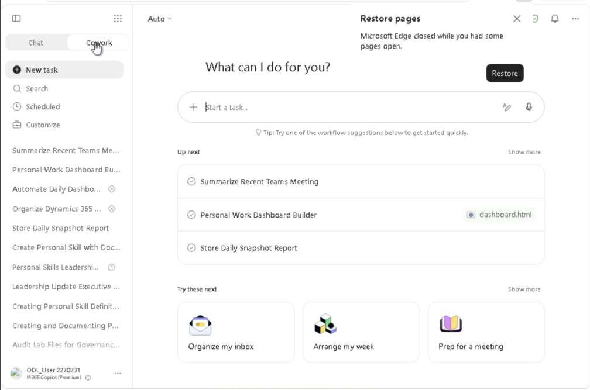

- *The Cowork tab (highlighted) sits beside the Chat tab at the top-left
  of the Microsoft 365 sidebar. Previous tasks are listed below the
  navigation icons on the left.*

After clicking Cowork, the main area shows “What can I do for you?” —
this is your Cowork home screen. Take a moment to notice the navigation
icons on the left:

- New task — starts a fresh Cowork conversation.

- Search — finds previous tasks by keyword.

- Scheduled — shows any automated or recurring tasks.

- Customize — lets you set preferences and rules for Cowork.

- Below these icons you will see a list of recent task names from
  previous sessions (e.g. “Audit Lab Files for Governance Issues”).
  These are for reference — ignore them for now.

## Step 2 — Start a New Task and enter the briefing prompt

3.  Click New task in the left navigation panel. The central input box
    becomes active. You are ready to give Cowork your first instruction.

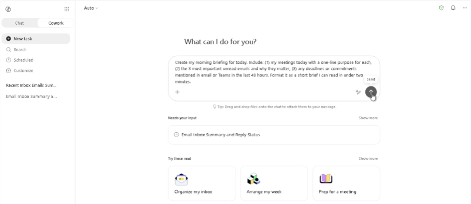

- *The Cowork home screen after clicking “New task”. The central text
  box (“What can I do for you?”) is active.*

- *Notice the suggested shortcuts below the input: “Organize my inbox”,
  “Arrange my week”, “Prep for a meeting” — these are quick-start
  templates.*

4.  Type or paste the following prompt into the input box, then press
    Send (the arrow icon) or hit Enter:

[TABLE]

[TABLE]

## Step 3 — Watch Cowork work

After you send the prompt, Cowork begins working immediately. Watch what
happens in the Workspace panel on the right side of the screen.

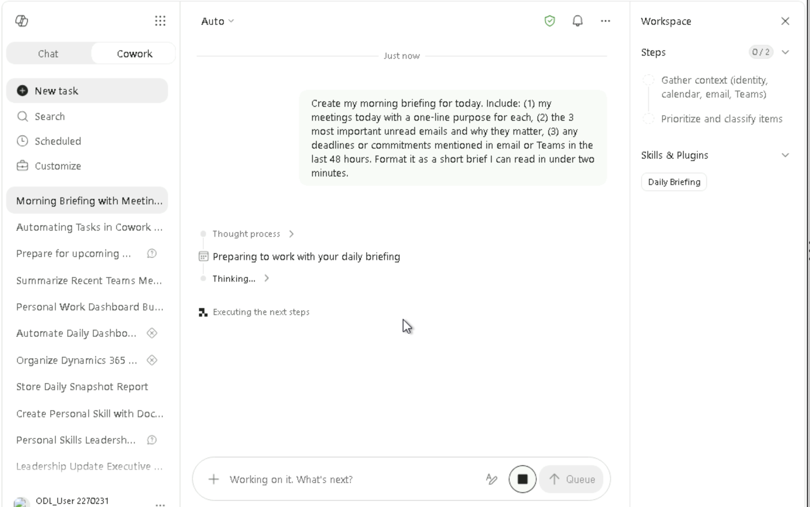

- *Cowork acknowledges the task and begins processing. The Workspace
  panel (right) shows Steps 0/3: the first two steps — “Gather context”
  and “Prioritize and classify items” — are queued.*

- *The skill activated is “Daily Briefing”. The chat shows “Preparing to
  work with your daily briefing… Executing the next steps.”*

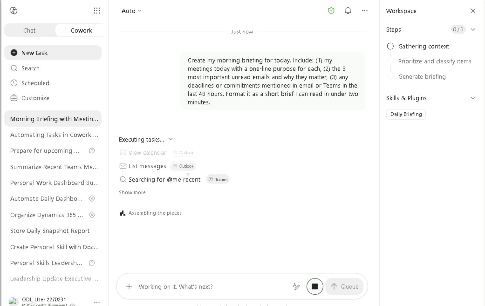

- *Cowork is now on Step 1 of 3: “Gathering context”. It is
  simultaneously reading your calendar (View calendar), listing your
  email messages (List messages via Outlook), and searching Teams for
  recent mentions (@me recent, via Teams).*

- *The status line reads “Assembling the pieces.”*

Once Cowork finishes gathering data (Steps 1–3 complete), it writes your
briefing in the main chat area:

- *The completed morning briefing. Cowork surfaces: upcoming meetings
  and their purpose, high-priority emails that need action, and
  commitments from Teams “Workflows” messages flagged as overdue.*

- *At the bottom, “Suggested First Moves” lists specific actions ranked
  by urgency.*

[TABLE]

5.  Read the briefing critically. Note one thing that is missing or
    weighted incorrectly — you will use this observation in the next
    step.

## Step 4 — Add a personalization rule and re-run

6.  In the same chat (do NOT click New task — stay in this
    conversation), type a follow-up instruction that adds a
    personalization rule. Use one of the examples below or write your
    own:

[TABLE]

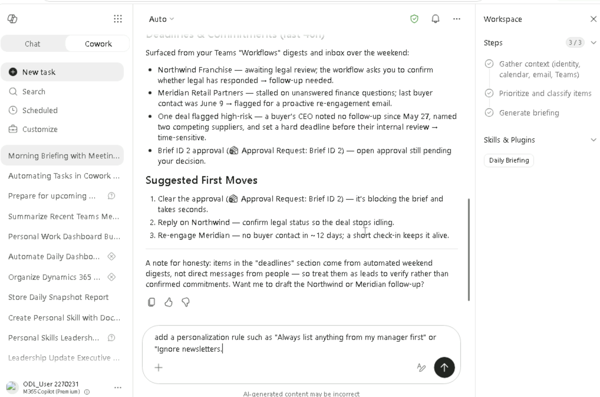

- *The follow-up prompt typed into the message box at the bottom. The
  previous briefing is visible above. Cowork is about to update its
  saved rules for all future briefings in this session.*

7.  Cowork will confirm the rules it has saved, and explain that they
    will apply automatically to all future briefings.

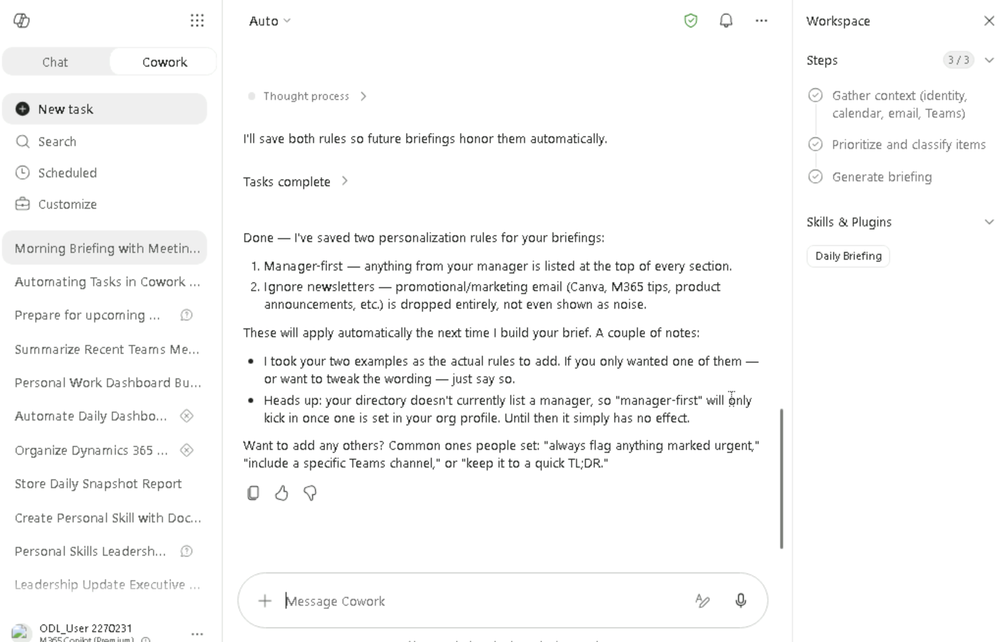

- *Cowork confirms it has saved two personalization rules: (1)
  Manager-first — anything from your manager appears at the top of every
  section; (2) Ignore newsletters — promotional email is dropped
  entirely. It also notes a caveat: “manager-first” only activates once
  a manager is set in your org profile.*

[TABLE]

# Exercise 2: Review Meetings and Calendar Priorities

*Skills used: Calendar Management — scans your full week, identifies
missing agendas, detects conflicts, and recommends actions.*

In this exercise you will ask Cowork to look across your entire week —
not just today — and give you specific recommendations about which
meetings deserve your attention and which can be shortened or declined.

[TABLE]

## Step 5 — Run the calendar review prompt

1.  Continue in the same Cowork conversation (do not start a new task).
    Type or paste the prompt below:

[TABLE]

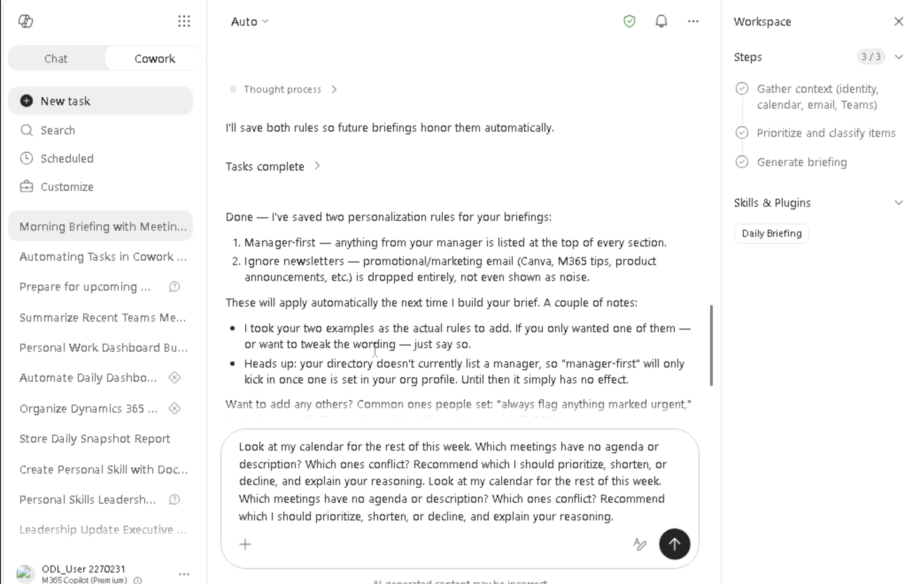

- *The calendar prompt typed at the bottom of the existing conversation.
  Note that the Workspace panel now shows an updated Steps list: “Scan
  calendar for rest of week and classify events” and “Triage and present
  recommendations” — two new steps have been added to the session.*

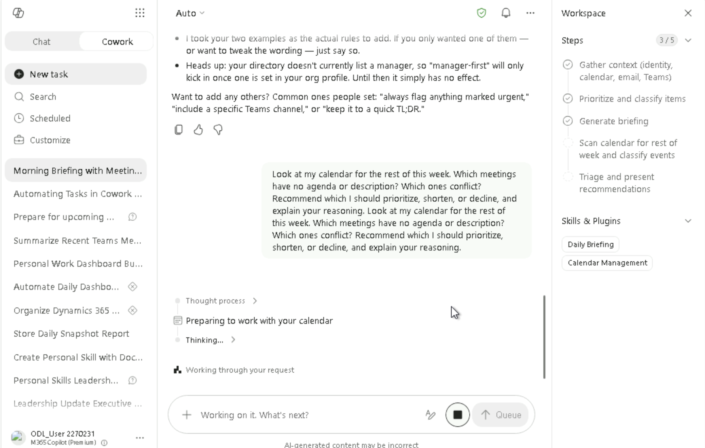

- *Cowork begins processing the calendar prompt. The Workspace panel
  (right) shows Steps 3/5: “Generate briefing” is complete (checked),
  and “Scan calendar for rest of week and classify events” is now
  active. The Skills & Plugins section now shows both “Daily Briefing”
  and “Calendar Management”, reflecting that both capabilities are in
  use for this session.*

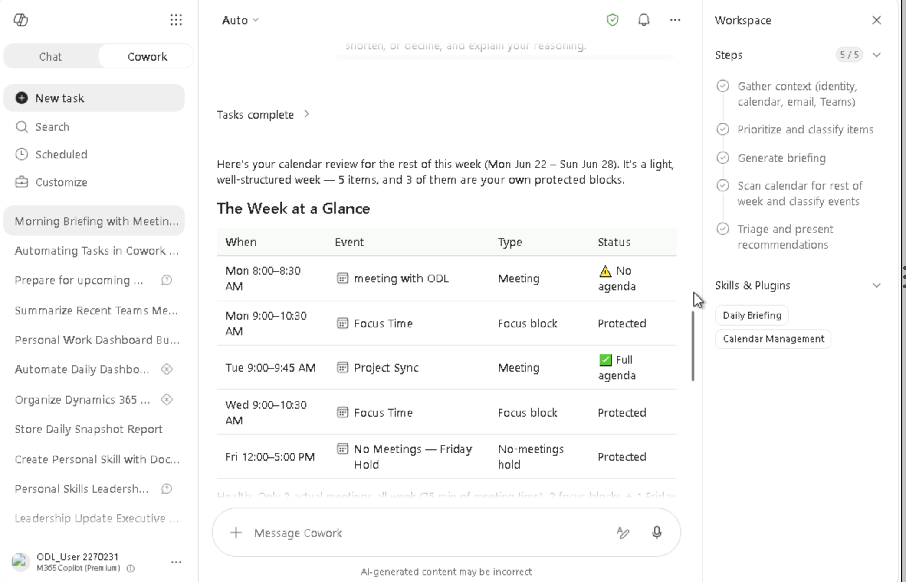

- *Cowork has completed the calendar scan (Steps 5/5 all checked). The
  response begins with a “Week at a Glance” table listing each event
  with its date, event name, type (Meeting / Focus block / No-meetings
  hold), and status (e.g., “No agenda” flagged in orange, “Full agenda”
  shown in green, “Protected” for focus blocks).*

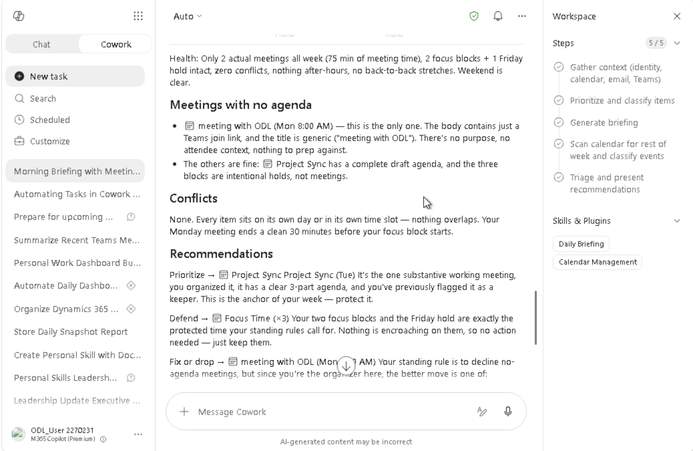

- *The calendar analysis continues below the table, broken into three
  clear sections: (1) Meetings with no agenda — lists the specific
  meeting(s) lacking a description or purpose; (2) Conflicts — confirms
  whether any events overlap; (3) Recommendations — labelled
  “Prioritize”, “Defend”, and “Fix or drop”, each with a specific
  rationale for the action. Scroll down to read all three sections.*

[TABLE]

2.  Read each recommendation. For each one, ask yourself: “Would I
    actually do this?” The goal is to build judgment about when to trust
    AI calendar advice.

[TABLE]

# Exercise 3: Summarize Important Emails and Pending Actions

*Skills used: Email Triage — groups inbox messages into actionable
categories and drafts reply angles for urgent items.*

Managing email by opening every message is slow and reactive. In this
exercise, Cowork reads your last 3 days of email and organizes it into
three buckets so you can act on only what truly needs your attention.

[TABLE]

## Step 6 — Run the inbox triage prompt

1.  In the same Cowork conversation, type or paste:

[TABLE]

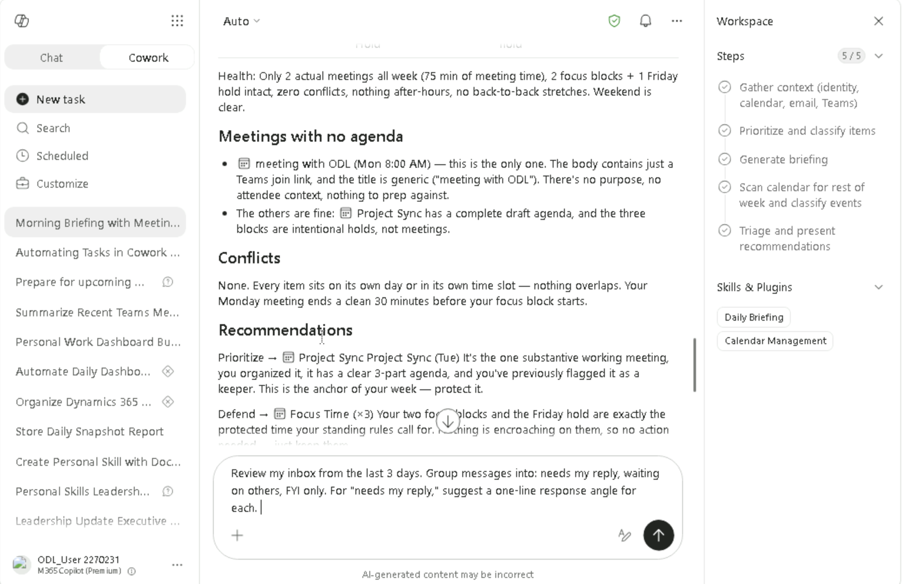

- *The inbox triage prompt entered at the bottom of the conversation.
  The Workspace panel (right) now shows Steps 5/5 complete from the
  previous exercise, and a new step — “Review inbox from last 3 days” —
  appears in the updated list. The session is building cumulatively:
  Cowork remembers the previous steps and adds to them.*

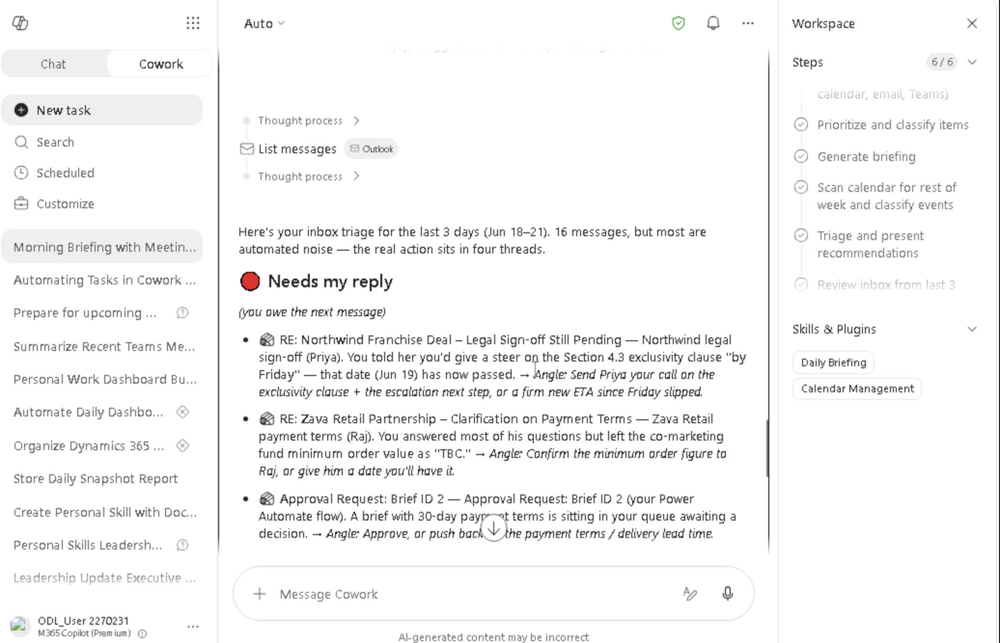

- *Cowork’s triage output — the “Needs My Reply” bucket. Each item is
  listed with: the subject line (bold), a brief summary of what the
  email is about, and an “Angle:” line — a suggested one-line response
  direction. Notice the red dot icon indicating urgency on overdue
  items. The Workspace panel (right) shows Step 6/6 complete.*

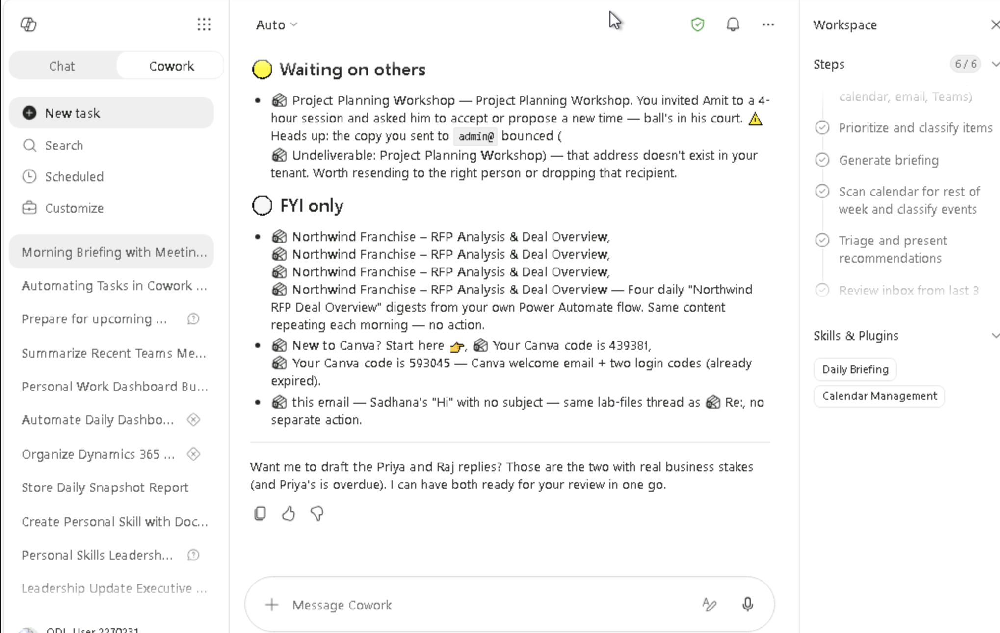

- *The “Waiting on Others” and “FYI Only” buckets. “Waiting on Others”
  shows an item with an invalid email address (flagged with a warning
  icon) — Cowork has noticed the bounce. “FYI Only” groups repeated
  automated digest emails together under a single entry rather than
  listing them individually. At the bottom, Cowork proactively offers to
  draft replies for the two highest-stakes items.*

**Step 7 — Correct the grouping with a follow-up**

AI triage is not always perfect. This step teaches you how to give
Cowork a correction mid-conversation. Look at the “FYI Only” list — if
you spot an email that should actually be in “Needs My Reply”, use the
prompt below to move it:

[TABLE]

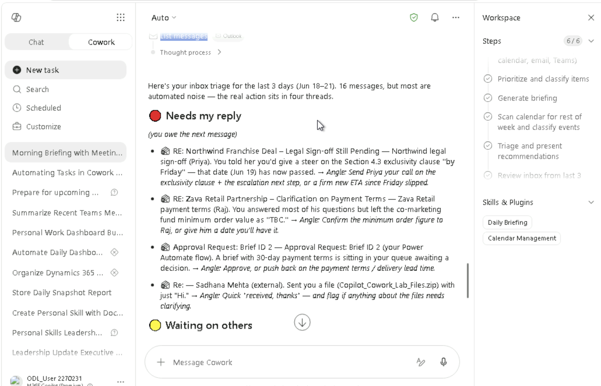

- *Cowork responds to the correction. It confirms which email it has
  matched (“Northwind Franchise Deal — Legal Sign-off Still Pending”),
  explains why it now qualifies as “Needs My Reply” (the “by Friday”
  exclusivity clause has passed), and saves a standing rule:
  contract/legal sign-off emails will always be treated as reply items
  going forward. The updated “Needs My Reply” list is shown with the
  corrected item now at position \#1.*

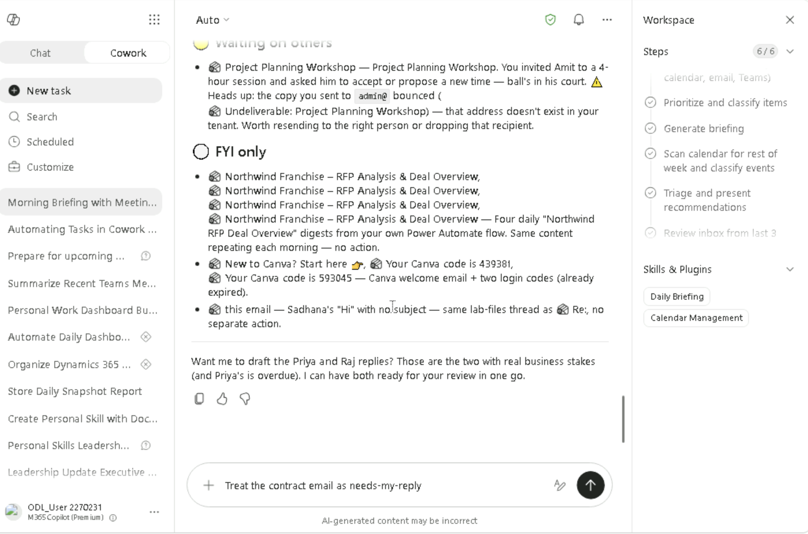

- *The follow-up correction message typed at the bottom of the chat.
  Cowork has moved the Northwind Franchise contract email to the “Needs
  My Reply” bucket and updated its reply angle to reflect the overdue
  exclusivity clause.*

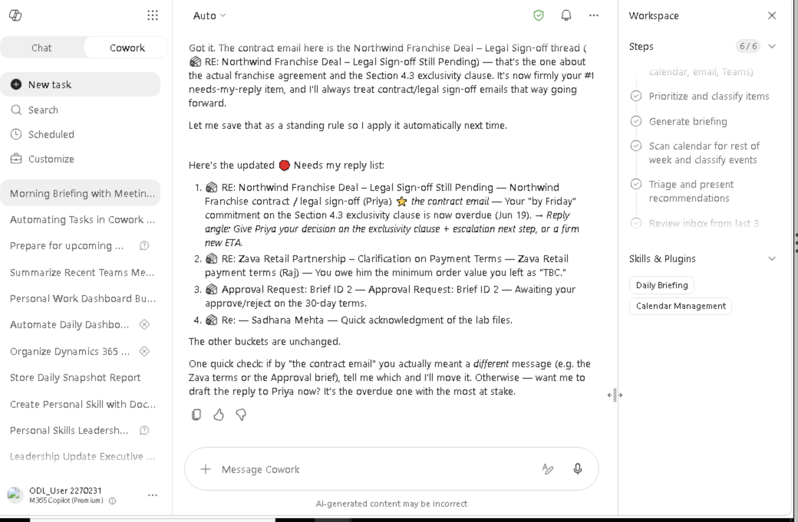

- *The updated “Needs My Reply” list after the correction. The Northwind
  Franchise email is now item \#1, with a specific reply angle: “Give
  Priya your decision on the exclusivity clause + escalation next step,
  or a firm new ETA.” The other three items follow. Cowork closes by
  asking a clarifying question — a sign that it is working
  collaboratively rather than just guessing.*

[TABLE]

**Exercise 4: Extract Tasks and Follow-up Items**

*Skills used: Task Extraction — reads email and Teams threads,
identifies commitments assigned to you, creates To Do tasks with due
dates.*

Buried in email threads and Teams conversations are commitments you made
— deadlines you agreed to, replies you promised, figures you offered to
confirm. In this exercise, Cowork finds all of them and turns them into
proper tasks.

[TABLE]

## Step 8 — Run the task extraction prompt

1.  In the same Cowork conversation, type or paste:

[TABLE]

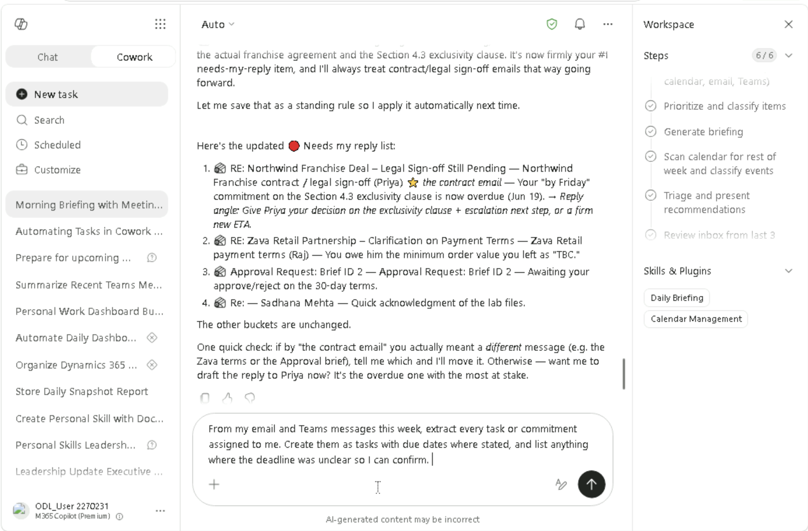

- *The task extraction prompt entered at the bottom of the conversation.
  The Workspace panel updates to show a new step: “Extracting
  commitments”. The session now has 6/7 steps completed from all
  previous exercises — Cowork is maintaining full context throughout.*

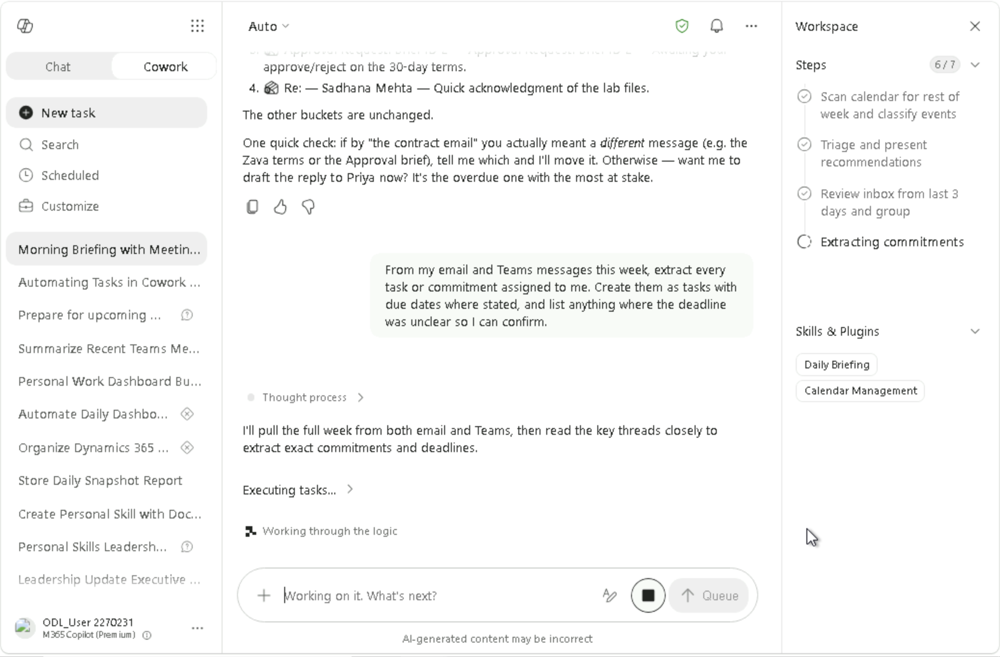

- *Cowork begins processing. The Workspace panel shows Steps 6/7 active,
  with “Extract commitments from email + Teams and create tasks” now
  visible. The chat shows: “I’ll pull the full week from both email and
  Teams, then read the key threads closely to extract exact commitments
  and deadlines.” Then: “Executing tasks…”*

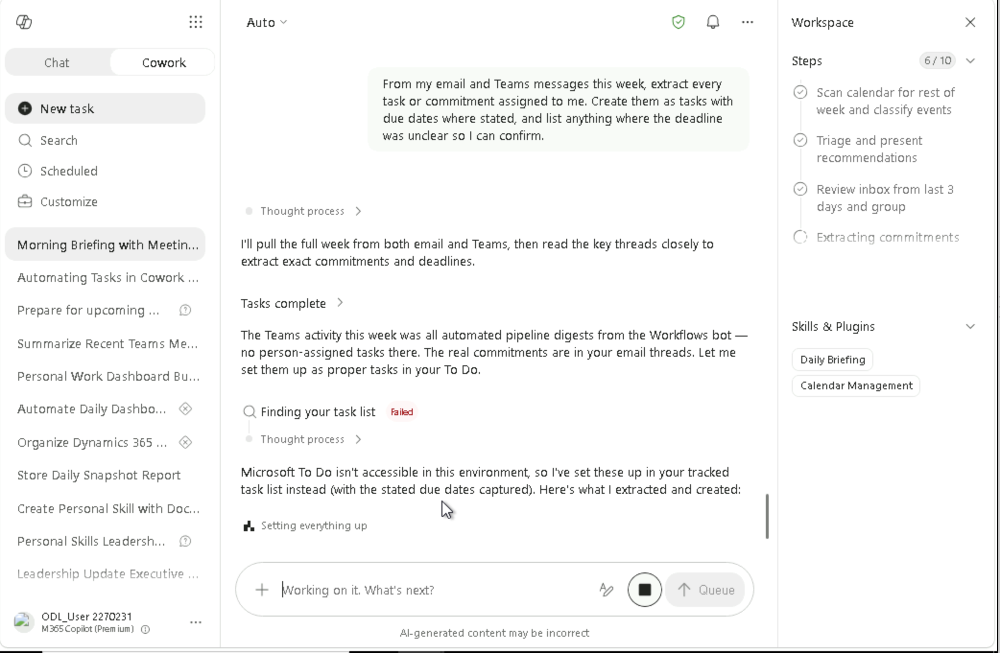

- *Cowork completes the Teams scan and reports a finding: “The Teams
  activity this week was all automated pipeline digests from the
  Workflows bot — no person-assigned tasks there.” It falls back
  gracefully: “Let me set them up as proper tasks in your To Do.” It
  then attempts to find the task list — and reports a minor issue:
  “Finding your task list: Failed. Microsoft To Do isn’t accessible in
  this environment.” This is expected behavior in some lab setups.*

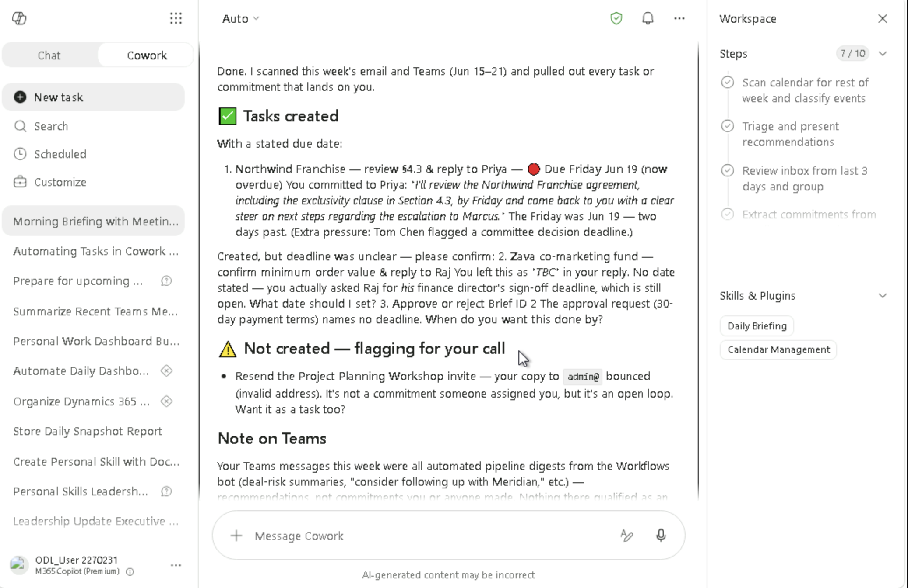

- *The task extraction results. Cowork presents two sections: (1) Tasks
  created — showing the Northwind Franchise task as Due Friday Jun 19
  (overdue), with full context about the commitment and why it is
  flagged red; (2) Not created — flagging for your call: the Project
  Planning Workshop invite bounce (not a true task assignment) with a
  note explaining why it was excluded. A “Note on Teams” explains why no
  Teams tasks were found.*

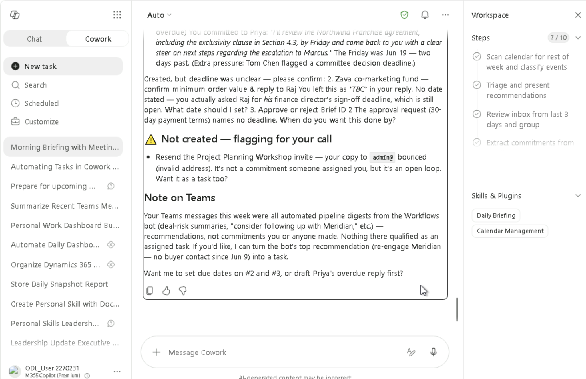

- *The extracted task list continued. Two tasks have unclear deadlines:
  the Zava co-marketing fund (no date given by the finance director) and
  the Approval Request Brief ID 2 (30-day payment terms, no deadline
  stated). Cowork lists both under “Created, but deadline was unclear —
  please confirm” and asks: “Want me to set due dates on \#2 and \#3, or
  draft Priya’s overdue reply first?” This is the agent asking rather
  than guessing.*

**Step 9 — Confirm ambiguous due dates**

When Cowork flags ambiguous deadlines, your job is to decide. This is a
key AI work habit: agents should ask when they don’t know, and humans
should decide. Type a response to confirm the dates:

[TABLE]

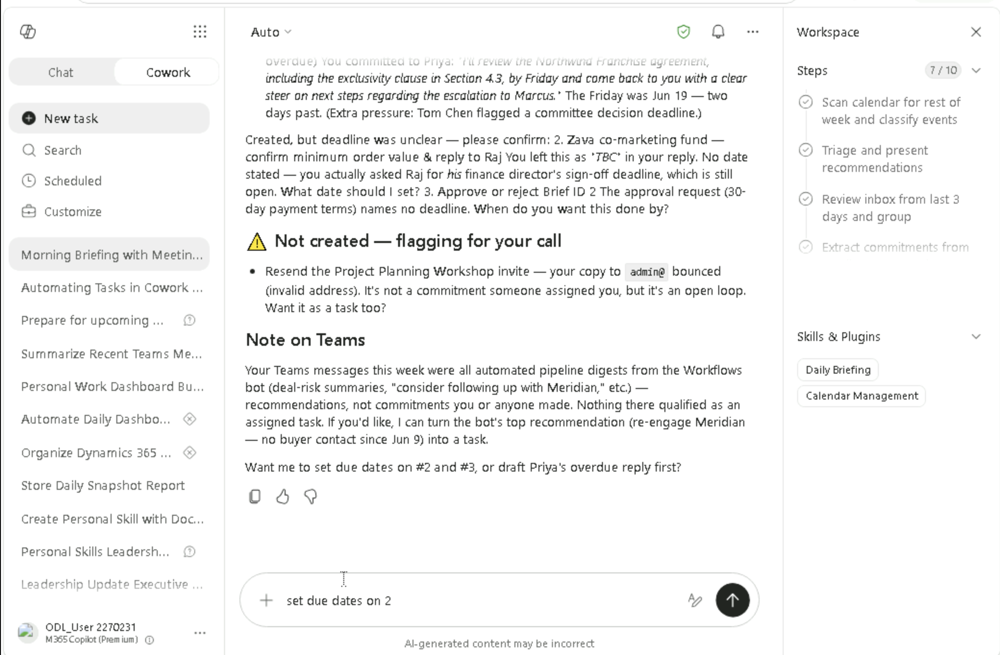

- *Cowork presents a “Due date” picker for task \#2 (the Zava
  co-marketing fund). It offers three suggested dates with
  reasoning: (1) Fri Jun 26 — end of week, keeps the deal moving without
  rushing; (2) Wed Jun 24 — mid-week, tighter given the active deal; (3)
  Mon Jun 22 — tomorrow, treat as urgent. A “Describe another option”
  field and a “Skip” button are also available.*

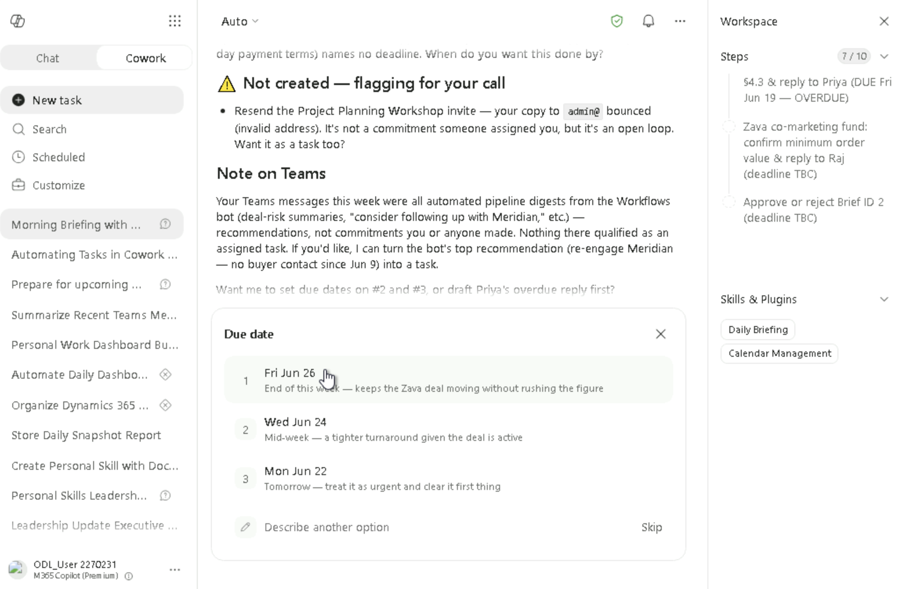

- *The due date picker with option 2 (Wed Jun 24) selected (highlighted
  in blue). The “Submit” button is active at the bottom right. Click
  your preferred option to submit.*

2.  Select your preferred due date option (option 2 — Wed Jun 24 is
    recommended for this lab) and click Submit.

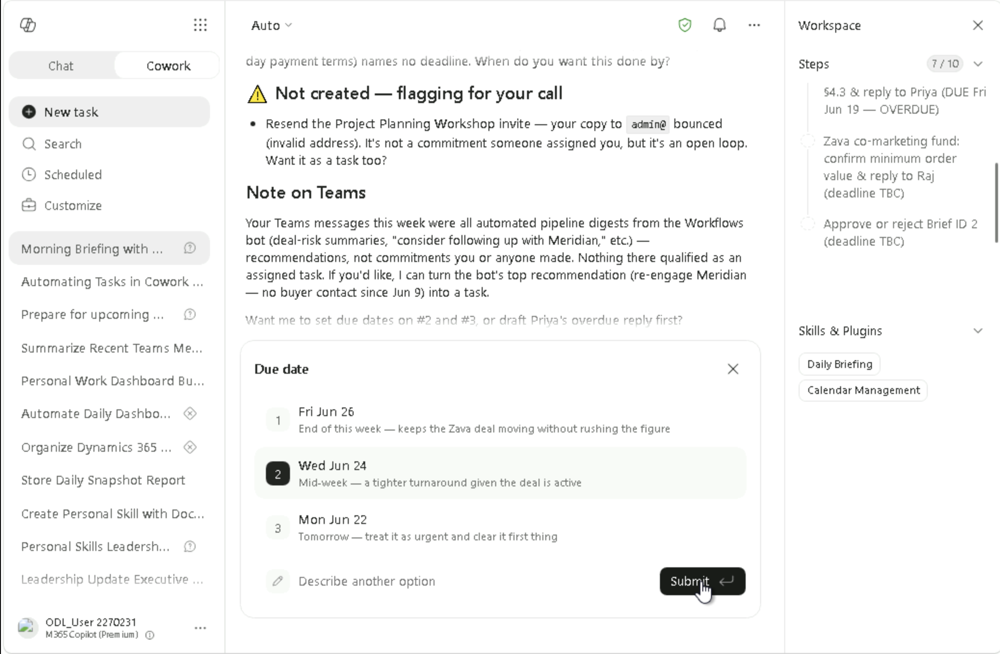

- *The due date selection confirmed. The Submit button is now active
  (visible at the bottom right of the date picker). Cowork is processing
  the selection.*

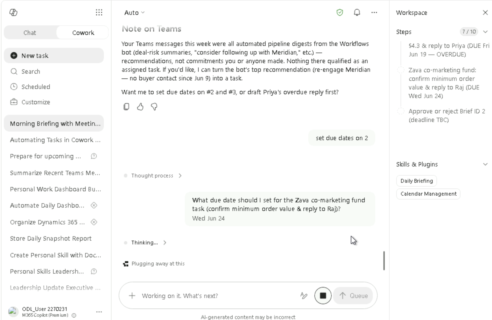

- *After submitting the date, Cowork asks for the due date of task \#3
  (Approve or reject Brief ID 2). It shows the task name again and asks:
  “What due date should I set for the Zava co-marketing fund task
  (confirm minimum order value & reply to Raj)? Wed Jun 24.” This
  confirms the first date was saved and Cowork is now handling the
  second ambiguous task.*

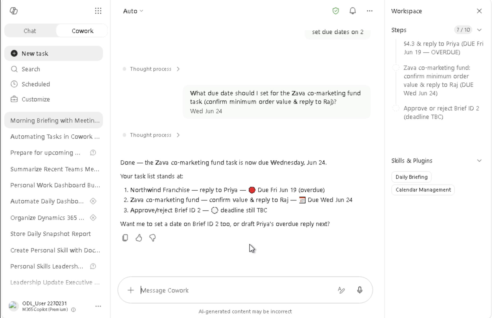

- *Task \#2 (Zava co-marketing fund) is confirmed as due Wednesday
  Jun 24. Cowork shows the updated task list: (1) Northwind Franchise —
  Due Fri Jun 19 (overdue); (2) Zava co-marketing fund — Due Wed Jun
  24; (3) Approve/reject Brief ID 2 — deadline still TBC. It asks: “Want
  me to set a date on Brief ID 2 too, or draft Priya’s overdue reply
  first?”*

## Step 10 — Review the complete task list

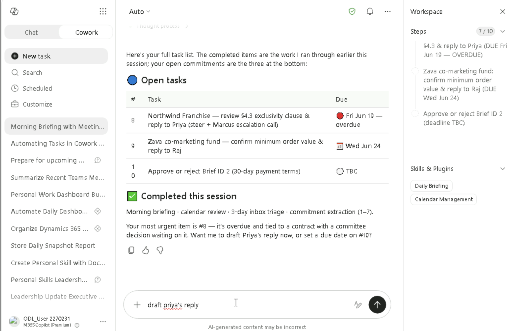

- *The final session task list. Cowork presents an “Open tasks” table
  with task numbers, descriptions, and due dates. Below, a “Completed
  this session” section confirms all actions taken in this conversation:
  morning briefing, 3-day inbox triage, and commitment extraction (steps
  1–7). Cowork closes by offering to draft Priya’s reply next.*

3.  Open Microsoft To Do (or Planner) or Calendar in a separate browser
    tab to verify the tasks were created. Confirm the task names, due
    dates, and that no extra tasks were invented.

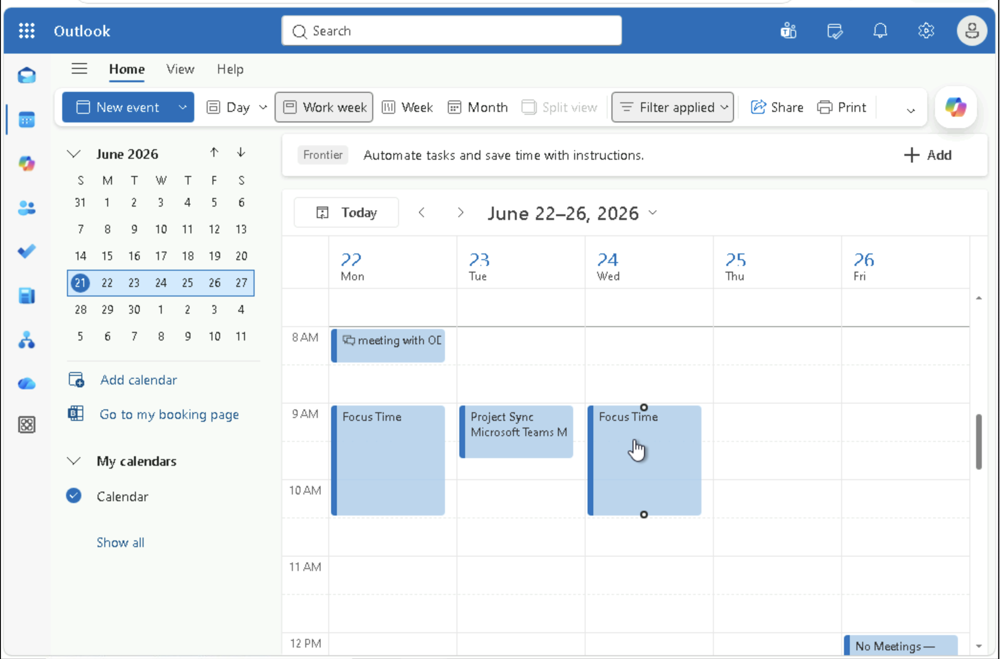

- *Outlook Calendar (opened separately to verify the week’s data). The
  Work Week view shows June 22–26, 2026. Events visible: Monday 8 AM
  “meeting with OD” (no agenda — this is the meeting Cowork flagged in
  Exercise 2), Monday/Wednesday 9 AM “Focus Time” blocks (protected),
  Tuesday 9 AM “Project Sync” (full agenda), and Friday “No Meetings
  Hold”. This confirms the calendar data Cowork was reading throughout
  the lab.*

[TABLE]

**Bonus: Draft a Reply Email (Optional)**

If you finished early, continue in the same session to see Cowork draft
an email reply on your behalf. This is not part of the formal lab but
demonstrates how Cowork can extend from triage to action.

[TABLE]

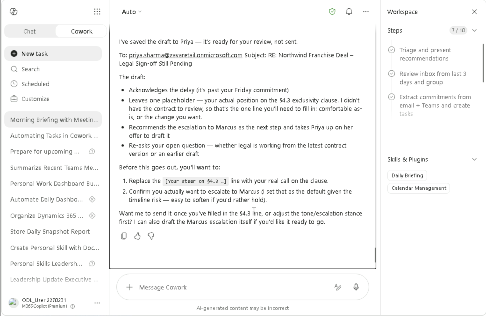

- *Cowork saves the Priya reply draft in Outlook. It summarizes what the
  draft contains: acknowledges the delay (it’s past the Friday
  commitment), leaves a placeholder for the actual legal position on the
  §4.3 exclusivity clause, recommends escalating to Marcus, and re-asks
  the open question about whether legal has the latest contract version.
  Three “Before this goes out” items are listed — things you must fill
  in before sending.*

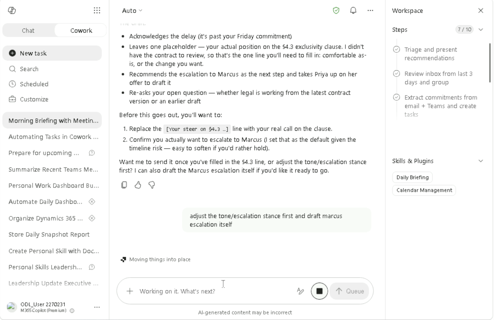

- *The user follows up: “adjust the tone/escalation stance first and
  draft marcus escalation itself.” Cowork accepts and begins working on
  both drafts simultaneously, as shown in the Workspace panel.*

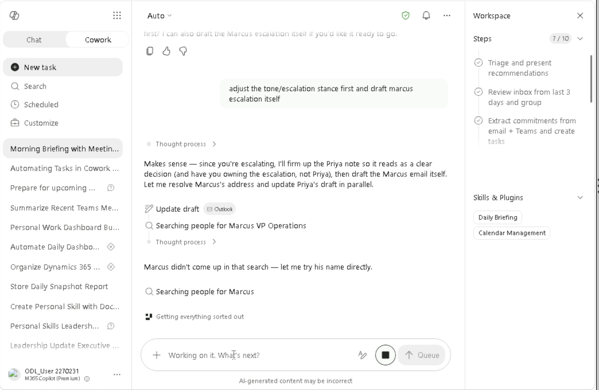

- *Cowork updates the Priya draft in Outlook (Update draft via Outlook)
  and searches for Marcus’s contact (“Searching people for Marcus VP
  Operations”). When no match is found, it tries a broader search
  (“Searching people for Marcus”). The step counter now reads 7/10,
  showing how a single follow-up can trigger multiple actions.*

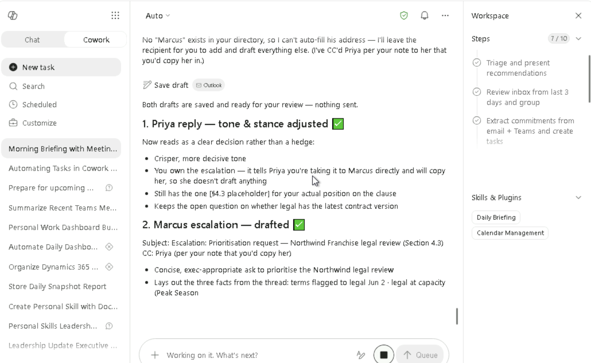

- *Both drafts are saved. The response is structured into two
  sections: (1) Priya reply — tone & stance adjusted (now reads as a
  clear decision rather than a hedge); (2) Marcus escalation — drafted
  (concise executive-appropriate subject and body, three key facts from
  the thread, CC’d to Priya). A “Before sending” checklist gives two
  manual steps required before either email goes out.*

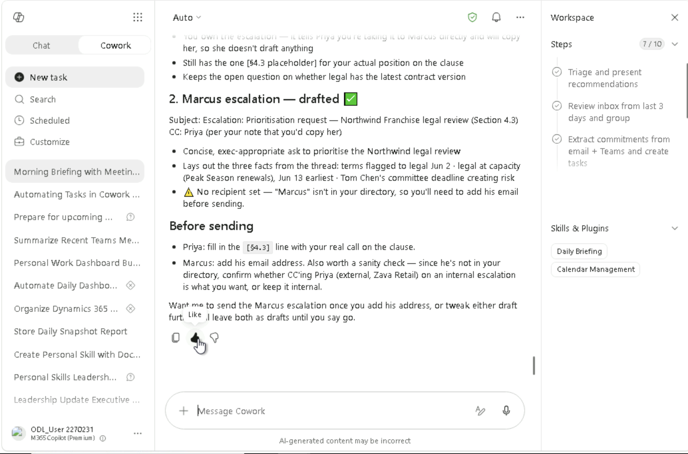

- *The Marcus escalation draft continues, showing: subject line, CC
  field, bullet-point body. A warning note: “No recipient set — Marcus
  isn’t in your directory, so you’ll need to add his email address.”
  Cowork leaves both as drafts, awaiting your final review and approval
  before sending.*

[TABLE]

### Final Validation Checklist 

Use this checklist to confirm you have completed all four exercises
successfully. Tick each item before submitting your lab work to your
instructor.

[TABLE]

### Key Concepts Recap

[TABLE]

### Troubleshooting Common Issues

[TABLE]

[TABLE]

[TABLE]

[TABLE]
