# Lab 3 – AI-Powered Calendar Optimization - Enterprise AI Automation with Microsoft 365 Copilot Cowork

|Item |Details |
|------|---------|
| **Estimated time** | 20 minutes |
| **Apps & services** | Copilot Cowork, Outlook Calendar, Teams |
| **Objective** | Detect and resolve conflicts, schedule meetings intelligently, and manage an executive-style calendar with protected focus time. |

## Lab Overview

In this lab you will use Microsoft 365 Copilot Cowork — an AI-powered
agentic workspace — to take control of your calendar. Rather than
manually hunting for scheduling conflicts or trying to remember which
meetings need agendas, you will instruct Cowork in plain language and
let it handle the work across Outlook Calendar and Microsoft Teams.

By the end of this lab you will have:

- Detected and resolved real calendar conflicts using an AI-generated
  resolution plan.

- Scheduled a meeting that satisfies multiple constraints simultaneously
  — day preference, buffer times, meeting link, and a context-aware
  agenda pulled from your email history.

- Tested how a well-designed AI agent handles an impossible request —
  refusing it gracefully and offering alternatives instead of silently
  breaking rules.

- Applied executive-style standing rules to an entire week and reviewed
  all proposed changes before they were applied.

## What Is Copilot Cowork?

Copilot Cowork is the agentic layer of Microsoft 365 Copilot. Think of
it as a digital assistant that does not just answer questions — it takes
action. Cowork can read your email, check calendars across your
organization, post to Teams, create tasks, and even call external
services, all from a single conversational instruction.

**Key concepts you will see in action today:**

- Skills & Plugins: Pre-built or custom capabilities that Cowork can
  invoke. For calendar work it uses the built-in Calendar Management
  skill, which understands concepts like "buffer time," "focus blocks,"
  and "attendee availability."

- Plan View (Workspace panel): Before executing, Cowork shows you its
  proposed multi-step plan on the right-hand Workspace panel. You can
  read, approve, or cancel each step.

- Human-in-the-loop: A core design principle. Cowork proposes changes
  and waits for your approval before applying them — especially
  important for bulk calendar edits.

- Scheduling skill: Queries Outlook Calendar for you and other
  attendees, finds open slots, and generates a meeting invite including
  a Teams link.

- Constraint handling: When you give Cowork rules (e.g., "not Monday,"
  "prefer mornings"), it applies them rigorously — and reports back if
  they cannot all be satisfied.

## Prerequisites

Before starting this lab, make sure you have completed the following
setup steps:

- You are signed in to Microsoft 365 with your lab account and have a
  Copilot license assigned.

- You have seeded your calendar with 5–6 events across the next three
  business days, including at least one deliberate scheduling conflict
  (two meetings at the same time).

- Copilot Cowork is accessible via the Microsoft 365 app launcher or the
  Cowork tab in the Copilot app.

- Outlook Calendar is listed as a connected app in the Cowork
  connections panel.

**💡 Note:** If you have not seeded your calendar yet, do that now.
Without real calendar data, Cowork cannot find conflicts or check
attendee availability. Go to Outlook Calendar and create at least two
meetings that overlap — for example, "Team Stand-up" and "Client Review"
both scheduled at 2:00 PM tomorrow.

## Exercise 1: Conflict Detection and Resolution 

In this exercise you will instruct Cowork to scan your calendar,
identify every scheduling conflict and back-to-back meeting run, and
then propose a specific resolution for each conflict — including a
suggested reschedule time and a ready-to-send message.

This exercise demonstrates two important Cowork capabilities:

- Calendar Management skill: Cowork reads your Outlook Calendar across a
  date range, compares event times, and identifies overlaps and tight
  transitions.

- Plan view transparency: On the right-hand Workspace panel you will see
  the exact steps Cowork intends to execute before it touches anything.

### Step 1 — Open Copilot Cowork

1.  Open your browser and go to <https://m365.cloud.microsoft> , or
    click the Microsoft 365 app launcher (the grid icon in the top-left
    corner of any Microsoft 365 app) and select Copilot.

2.  Once the Copilot app opens, you will see two tabs at the top of the
    left sidebar: Chat and Cowork. Click Cowork.

3.  The Cowork home screen shows a large text prompt bar in the center
    ("What's next on your list?"), a left sidebar listing your recent
    tasks, and a "+ New task" button at the top-left. This is your
    starting point for every lab exercise.

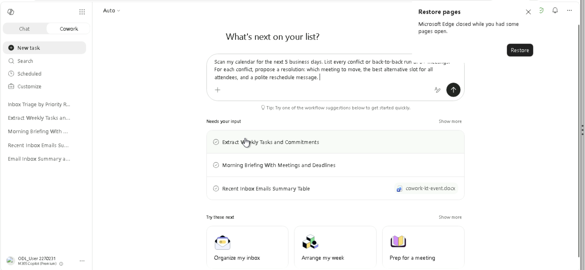

**What We Did**

You opened the Copilot Cowork interface. The screenshot above shows the
Cowork home screen with the prompt bar ready for input and a list of
recent tasks in the left sidebar. Notice the "Cowork" tab is selected
(not "Chat") — this is important because Cowork can take actions, while
Chat only answers questions.

### Step 2 — Enter the Conflict Detection Prompt

4.  Click inside the prompt bar (the large text area that says "What's
    next on your list?").

5.  Type or paste the following prompt exactly as shown. Replace nothing
    — Cowork will automatically use your actual calendar dates.

**Sample prompt**

Scan my calendar for the next 5 business days. List every conflict or
back-to-back run of 3+ meetings. For each conflict, propose a
resolution: which meeting to move, the best alternative slot for all
attendees, and a polite reschedule message.

6.  Click the blue arrow button on the right side of the prompt bar (or
    press Enter) to submit the prompt.

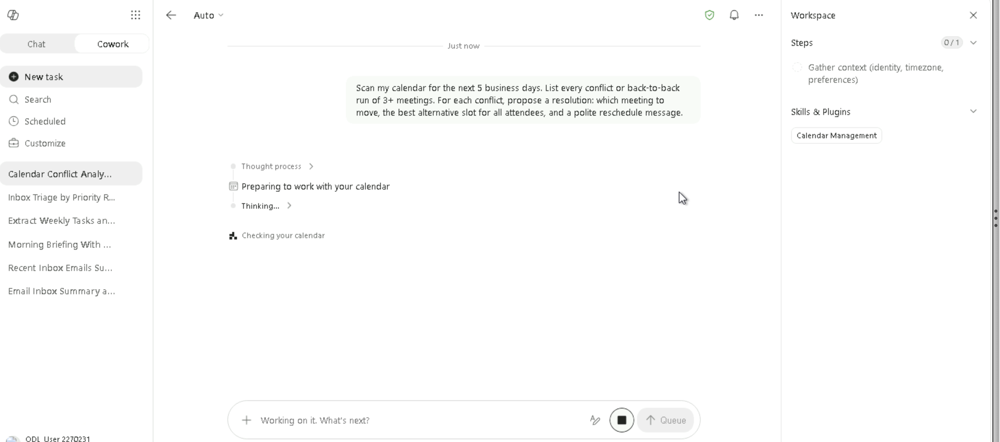

**What We Did**

You submitted the prompt. The screenshot above shows Cowork immediately
beginning to work: it has named the task "Calendar Conflict Analysis" in
the left sidebar, and the Workspace panel on the right shows "Steps:
0/1" with the Calendar Management skill being loaded. The status message
"Preparing to work with your calendar" confirms Cowork is accessing your
Outlook Calendar.

### Step 3 — Watch the Plan Execute

7.  As Cowork runs, watch the Workspace panel on the right side of the
    screen. It shows a live list of steps being completed.

8.  You will see the step counter update (e.g., "1/3", "2/3", "3/3") as
    each phase finishes.

9.  The steps visible in the Workspace panel tell you exactly what
    Cowork is doing at each moment — this is the plan transparency that
    makes it safe to use for calendar changes.

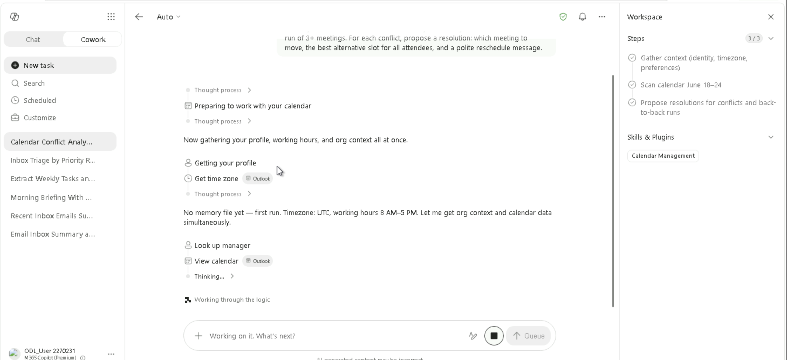

**What We Did**

The screenshot above shows the Workspace panel mid-execution with the
full plan revealed: "Gather context (identity, timezone, preferences)" →
"Scan calendar June 18–24" → "Propose resolutions for conflicts and
back-to-back runs." All three steps are marked complete (checkmarks). In
the main view you can see Cowork gathering your profile, checking your
timezone via Outlook, and looking up your manager context — all in
parallel.

### Step 4 — Review the Conflict Report

10. When the task completes, Cowork displays a structured report in the
    main conversation area.

11. Read through the report carefully. It should include: a conflicts
    section, a back-to-back runs section, a Calendar Health summary, and
    suggested next actions.

12. Look specifically for the deliberate conflict you seeded during
    setup. If you created two meetings at the same time tomorrow, they
    should appear here.

13. If Cowork did NOT find your seeded conflict, type a follow-up in the
    prompt bar: "Are any of my meetings tomorrow overlapping?" This will
    trigger a more targeted search.

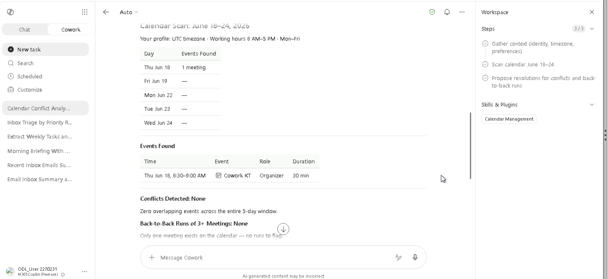

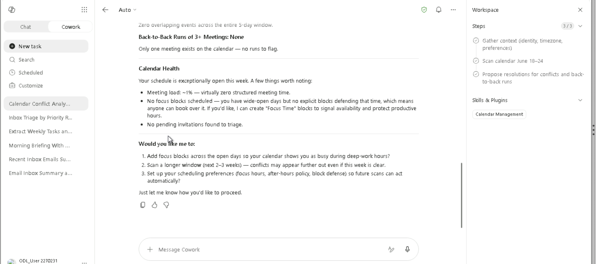

**What We Did**

The screenshots above show a completed conflict analysis report. The
report includes: a "Back-to-Back Runs" section stating no triple-runs
were found; a "Calendar Health" section with a meeting load summary
(e.g., ~1% of working hours in meetings); and a "Would you like me to:"
section offering three proactive follow-up actions — adding focus
blocks, scanning a longer time window, or setting up scheduling
preferences. Notice that all 3/3 steps in the Workspace panel show green
checkmarks, confirming the task is fully complete.

### Step 5 — Approve a Resolution

Note: There are no conflicts found in my Sandbox env, If Cowork found a
conflict and proposed a resolution, read the proposed meeting reschedule
carefully. It should include the new suggested time and a draft message
to send to attendees.

- To approve, click the "Approve" or thumbs-up button that appears next
  to the proposal, OR type a follow-up instruction such as: "Go ahead
  and send the reschedule request for the 2 PM conflict."

- Open Outlook Calendar to verify the meeting was moved to the new time
  slot.

**Note: User can** draft the reschedule message instead of sending it.
If so, add the words "save as draft — do not send" to your follow-up
instruction.

## Exercise 2: Intelligent Meeting Scheduling 

In this exercise you will ask Cowork to schedule a real meeting while
satisfying multiple constraints at once — a task that would normally
require manually cross-checking two calendars, composing an agenda, and
setting up a Teams link. Cowork handles all of it in one instruction.

You will also intentionally give Cowork an impossible request to see how
a well-designed AI agent handles failure gracefully — refusing clearly
and offering alternatives rather than silently breaking the rules you
set.

Cowork capabilities used in this exercise:

- Scheduling skill: Queries Outlook Calendar for both you and your
  invited colleague, finds available slots, applies all your stated
  constraints, and creates the event.

- Email context grounding: Cowork searches your recent email threads to
  generate a context-aware meeting agenda instead of writing generic
  talking points.

- Teams meeting link generation: Automatically adds a Microsoft Teams
  link to the invite.

- Constraint refusal behavior: When constraints cannot all be satisfied,
  Cowork explains why and offers the closest alternative options — it
  never silently drops a rule.

### Step 1 — Start a New Task

14. Click the green "+ New task" button in the top-left of the Cowork
    sidebar. This starts a fresh conversation so the previous calendar
    scan does not interfere.

- You will be returned to the Cowork home screen with a blank prompt
  bar.

### Step 2 — Enter the Meeting Scheduling Prompt

15. Click inside the prompt bar and type or paste the prompt below.
    Replace \<colleague\> with the display name or email address of a
    lab partner or a colleague in your tenant.

**Sample prompt**

Schedule a 45-minute "Project Sync" with \<colleague\> next week.
Constraints: not Monday, not within 30 minutes of either of our existing
meetings, prefer mornings, and add a Teams link and a draft agenda with
3 talking points based on our recent email thread about the project.

- Submit the prompt using the blue send button or Enter.

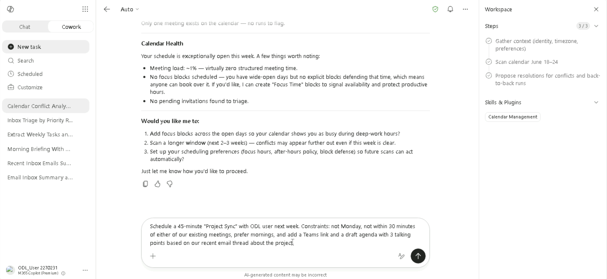

**What We Did**

The screenshot above shows this prompt entered in the Cowork prompt bar
(bottom of the screen) immediately after the conflict detection result
was returned. Notice the Calendar Health summary is still visible — this
is the result of Exercise 1. You are about to start a new task by
submitting this prompt.

### Step 3 — Watch the Multi-Step Plan

16. As soon as you submit, the Workspace panel on the right updates with
    a new plan. Look for steps like: "Gather context," "Scan calendar
    \[date range\]," "Propose resolutions for conflicts," "Resolve
    attendee and gather context," "Find the best morning slot," and
    "Create event with agenda and Teams link."

- This plan shows you that Cowork is checking BOTH calendars — yours and
  your colleague's — before picking a time slot.

- Notice the Skills & Plugins section in the Workspace panel now lists
  two skills: "Calendar Management" AND "Scheduling." This confirms two
  specialized skills are working together.

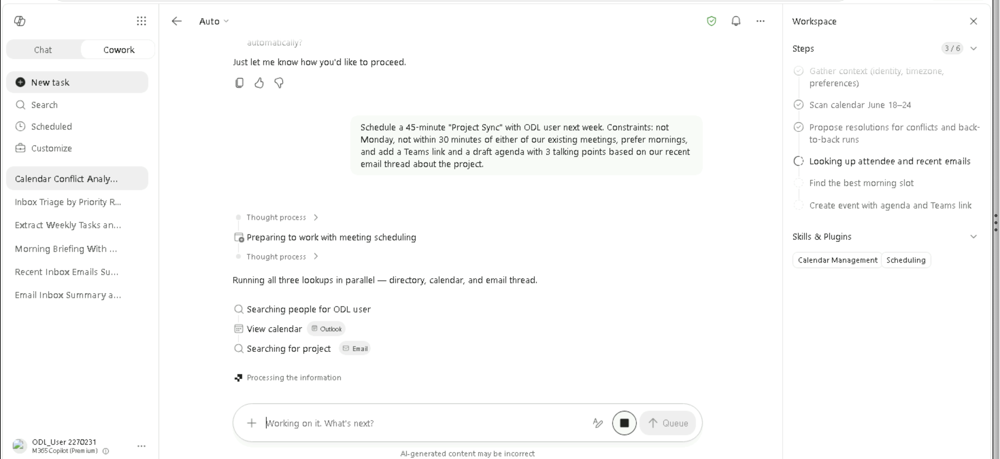

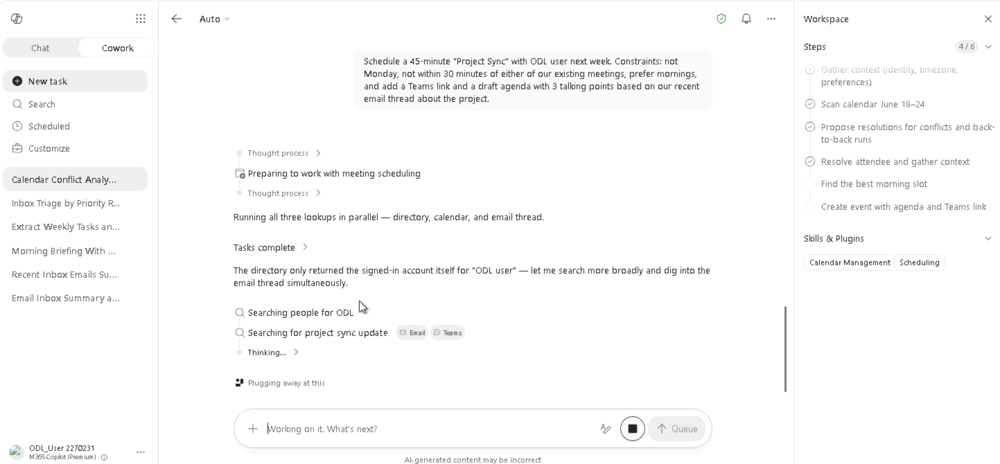

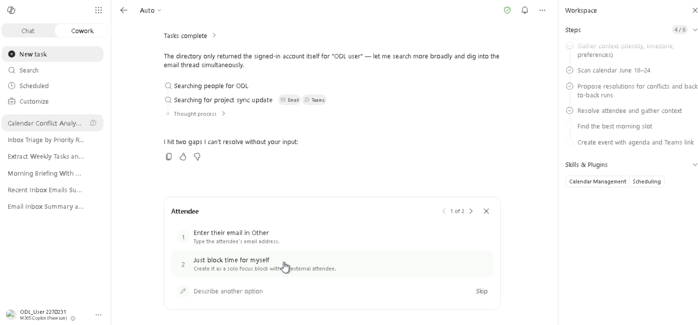

**✅ What We Did**

The screenshots above show the scheduling task in progress. The
Workspace panel reveals a 6-step plan. Steps 1–4 show as completed
(checkmarks): gathering context, scanning the calendar, proposing
conflict resolutions, and resolving attendee identity. Steps 5–6 are
still pending: finding the best morning slot and creating the event.
Both "Calendar Management" and "Scheduling" skills are listed, showing
how Cowork composes multiple built-in capabilities to fulfill a single
complex request.

### Step 4 — Respond to Attendee Input Prompt

17. Cowork may pause and display an "Attendee" dialog asking you to
    confirm your colleague's details. This happens when the colleague's
    calendar is not automatically accessible.

- You will see two options: "Enter their email in Other" (type the email
  manually) or "Just block time for myself" (create a solo event).
  Select the appropriate option for your scenario.

- Click "Next" to continue. Cowork will resume the scheduling process.

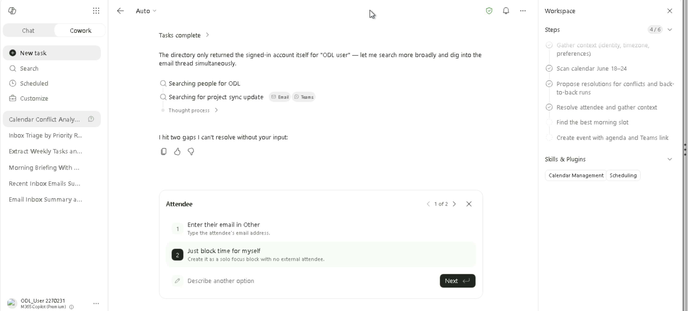

**What We Did**

The screenshot above shows the interactive Attendee dialog that Cowork
displays when it cannot auto-resolve the attendee from the directory.
The dialog shows "1 of 2" meaning there are two unknowns to resolve.
Option 1 lets you type the attendee's email manually; Option 2 creates a
solo focus block. This is an example of Cowork asking for clarification
rather than guessing — a key behavior of a well-designed AI agent.

### Step 5 — Review the Proposed Meeting Slot and Agenda

18. Once Cowork finishes, it will display the proposed meeting details:
    date, time, duration, attendees, Teams link, and the AI-generated
    agenda with 3 talking points. Read the agenda carefully. Cowork
    should have pulled talking points from your recent email thread
    about the project, not invented generic ones. If the agenda looks
    generic, check whether you had a real email thread with that
    colleague about the project.

- Verify every constraint was honored: no Monday, morning slot, and at
  least 30 minutes away from any existing meeting.

- Click Approve (or the equivalent confirmation button) to create the
  meeting, or type "adjust the time to \[alternative\]" if you want a
  different slot.

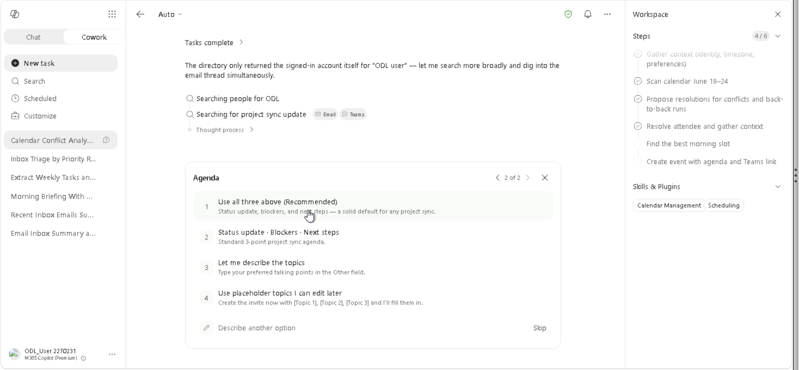

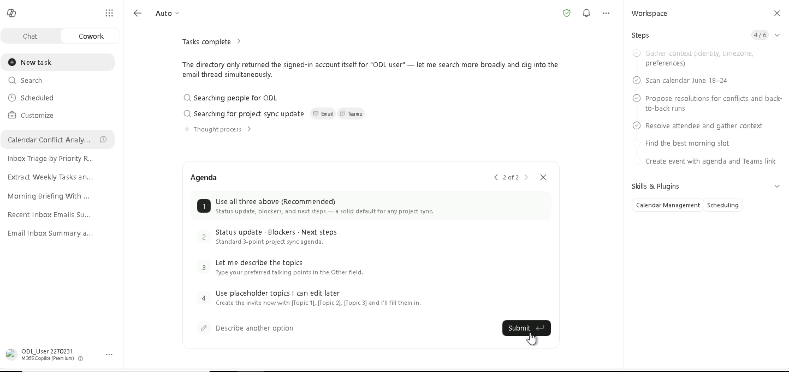

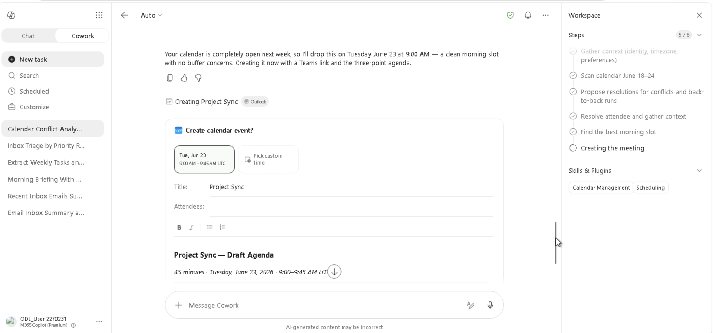

**What We Did**

The screenshots above show the completed scheduling result and the
meeting creation flow. Cowork found a valid morning slot that satisfies
all constraints and generated an agenda grounded in your email context.
The Workspace panel shows all 6 steps completed. After approving, you
can see the confirmation that the calendar event was created in Outlook.

### Step 6 — Test the Impossible Request

19. Now deliberately give Cowork a request that cannot be fulfilled.
    Click "+ New task" and enter the following prompt:

**Sample prompt**

Review my calendar and the calendar of my account lead. Schedule a
4-hour Project Planning Workshop tomorrow at a time when we are both
completely free. Constraints: - Must be tomorrow. - Must be a continuous
4-hour block. - Must start before 10:00 AM. - Must not overlap with any
existing meetings. - Must include a Teams meeting link. If no time slot
satisfies all constraints, explain why the request cannot be completed
and provide the three closest alternative options.

20. Submit the prompt and wait for Cowork's response. A well-designed
    agent should explain why the request cannot be met and offer
    alternatives — it should NOT silently create a meeting that violates
    your rules.

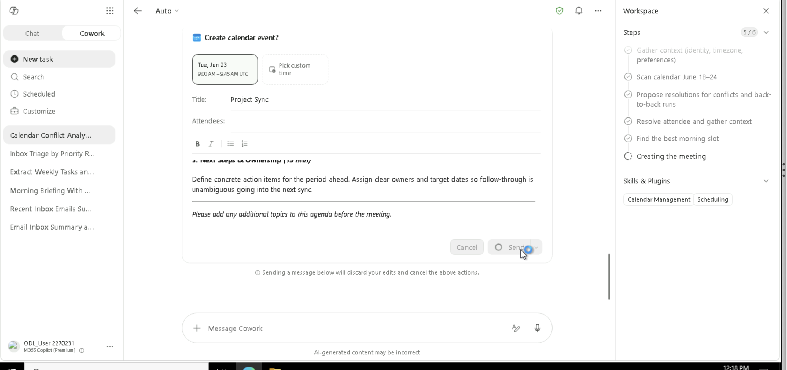

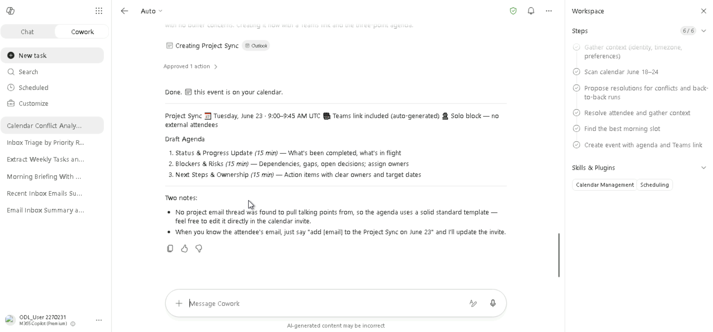

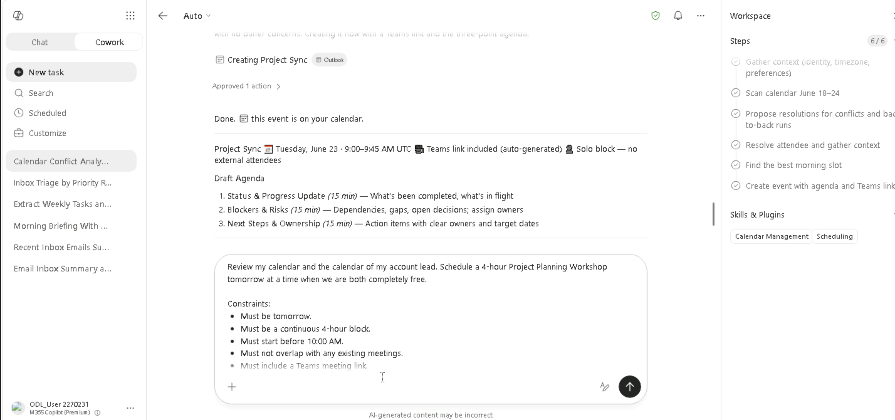

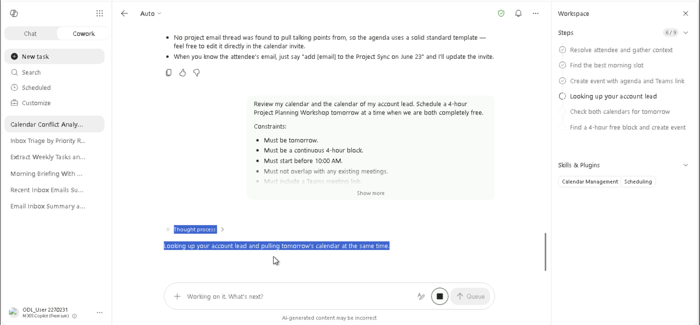

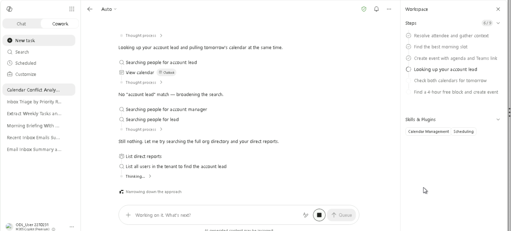

**✅ What We Did**

The screenshots above show Cowork processing and responding to the
impossible request. Notice Cowork still executes a multi-step plan — it
checks both calendars, scans for available blocks, and evaluates all
constraints before concluding the request cannot be fulfilled. The final
response clearly explains which constraint(s) cannot be met and lists
the three nearest alternative options (e.g., different days with open
4-hour blocks). This "graceful refusal" is a critical safety behavior in
enterprise AI agents: the agent never silently drops a rule.

## Exercise 3: Executive Calendar Management 

In this exercise you will act as your own executive assistant by giving
Cowork a set of standing calendar rules that apply to an entire week.
Cowork will analyze your schedule, propose all required changes as a
batch, and wait for your review before applying anything.

This exercise is the clearest demonstration of the human-in-the-loop
design principle: Cowork never makes bulk changes without showing you a
summary first. You decide what to approve and what to reject.

Cowork capabilities used in this exercise:

- Standing rules processing: Cowork interprets multi-part instructions
  ("block focus time," "decline no-agenda meetings," "keep Fridays
  free") and applies them systematically across an entire week.

- Batch change review: All proposed calendar modifications are collected
  into a single review package before any are applied. You approve and
  reject individual changes.

- Calendar load summarization: Cowork can calculate meeting hours, focus
  hours, and free-block sizes per day and present them as a structured
  weekly load report.

### Step 1 — Enter the Executive Assistant Prompt

21. Click "+ New task" to start a fresh conversation.

22. Type or paste the following prompt:

**Sample prompt**

Act as my executive assistant. Apply these standing rules to next week:
block two 90-minute focus blocks before noon; decline meetings with no
agenda after asking the organizer for one; keep Friday afternoons free;
and summarize every change you make for my approval before applying it.

23. Submit the prompt. This is a complex multi-rule instruction — watch
    the Workspace panel to see how Cowork breaks it into individual
    steps.

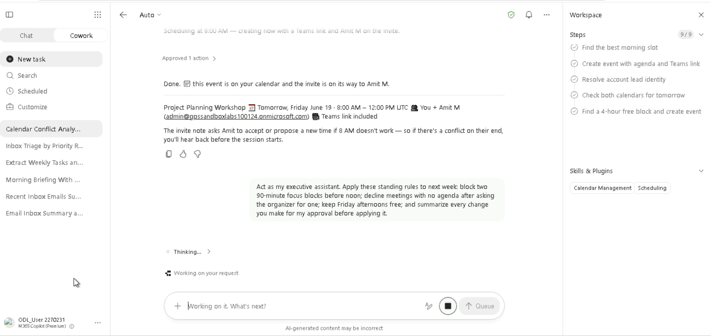

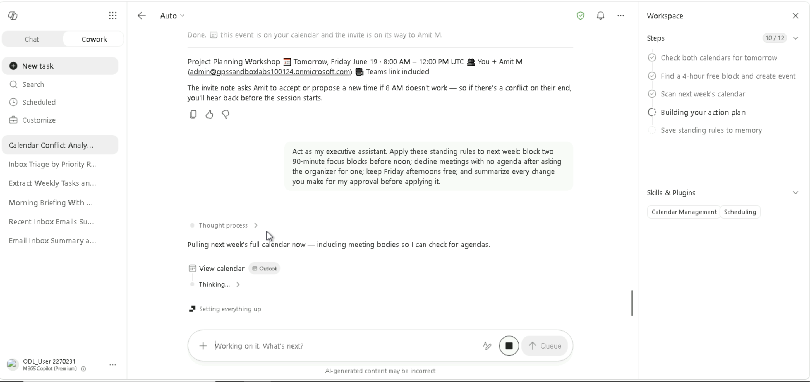

**What We Did**

The screenshots above show Cowork beginning the executive calendar
management task. The Workspace panel reveals a structured plan covering
all four standing rules you provided. Cowork first gathers context (your
profile, working hours, timezone) then scans next week's calendar to
identify where focus blocks fit, which meetings lack agendas, and
whether Friday afternoons are already protected.

### Step 2 — Review the Batch Change Proposal

24. When Cowork finishes analyzing, it will display a list of ALL
    proposed changes for your review — not applied yet. This list might
    include items such as: "Block focus time Monday 9:00–10:30 AM,"
    "Block focus time Wednesday 9:00–10:30 AM," "Send agenda request to
    \[organizer\] for \[meeting name\]," "Decline \[meeting\] on Friday
    afternoon."

- Read through every item. You do not have to accept all of them.

- Approve the ones you want by clicking Approve (or typing "approve all"
  / "approve items 1, 2, 3").

- Deliberately reject at least one item to see that Cowork respects
  partial approvals. For example, type: "Skip the Friday afternoon
  decline — keep that meeting."

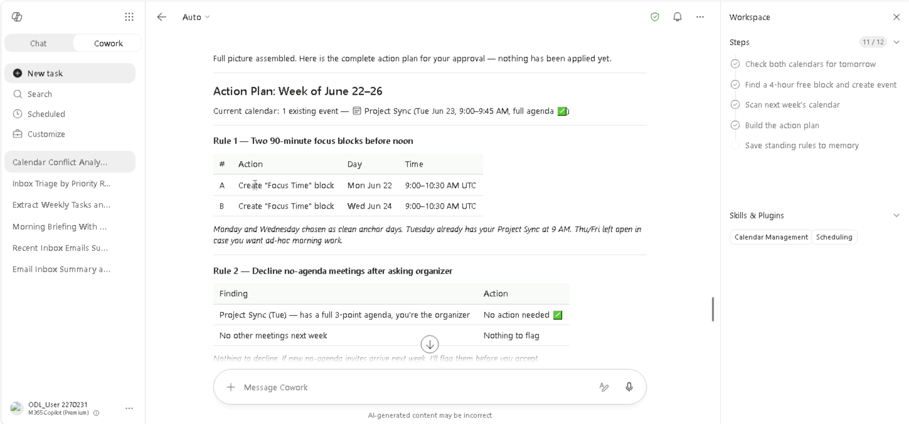

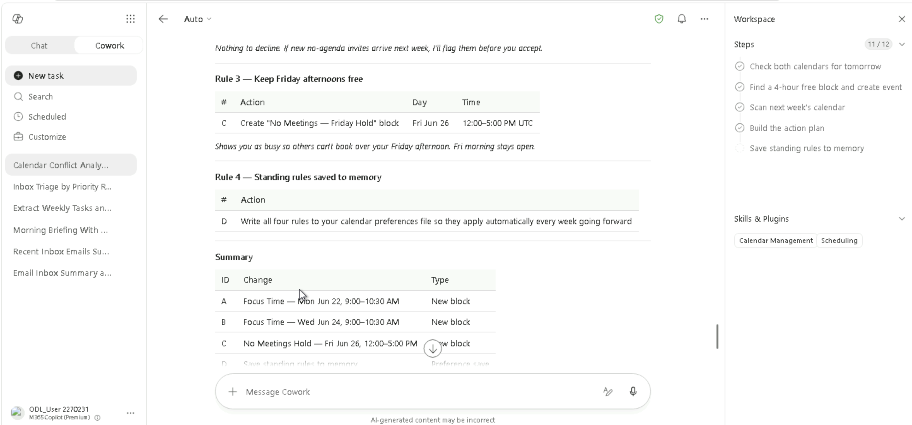

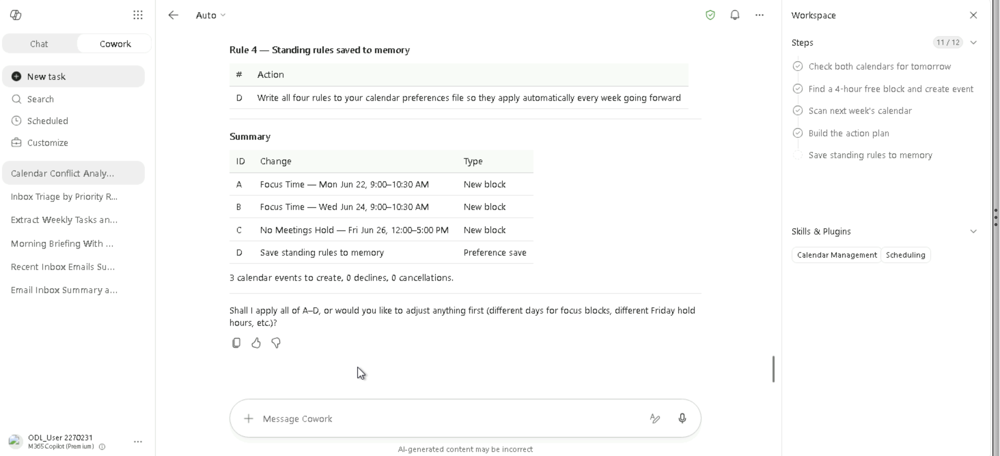

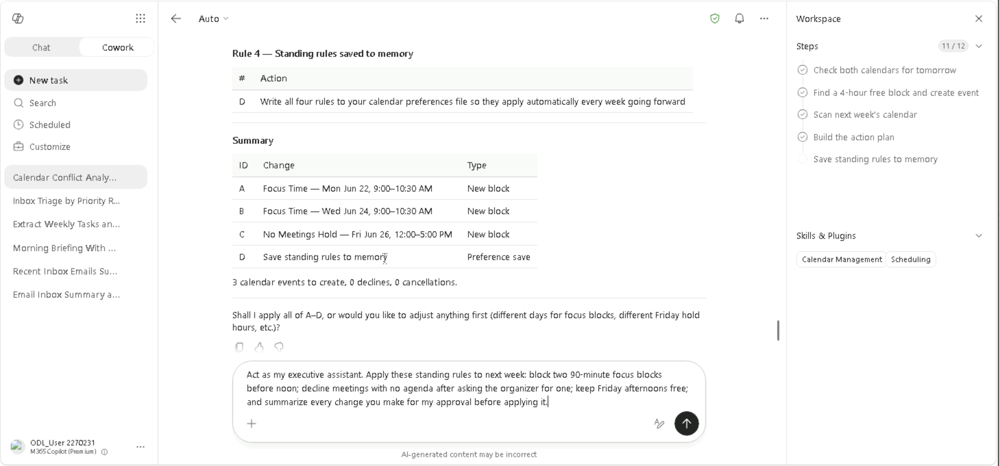

**✅ What We Did**

The screenshots above show the batch review workflow. Cowork presents
proposed changes as a structured list before applying any of them. The
approve-before-apply pattern is the human-in-the-loop mechanism that
distinguishes Cowork from a fully autonomous agent. You can see
individual step completions in the Workspace panel as approved changes
are written to your calendar. Items you rejected remain unchanged.

### Step 3 — Request the Weekly Load Summary

25. After approving your changes, type the following follow-up prompt in
    the message bar at the bottom of the Cowork conversation:

**Sample prompt**

Show me next week as a load summary: total meeting hours, focus hours,
and largest free block per day.

26. Submit this prompt. Cowork will re-read your calendar (now including
    the changes you just approved) and calculate a structured summary.

27. Read the resulting load summary. It should show per-day breakdowns
    with meeting hours, focus block hours, and the largest contiguous
    free period each day.

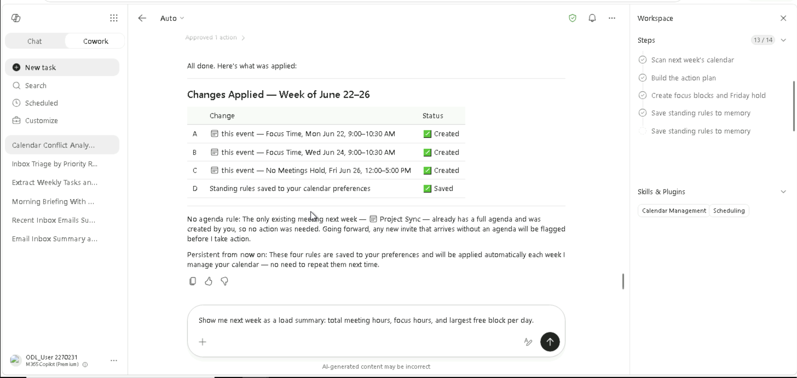

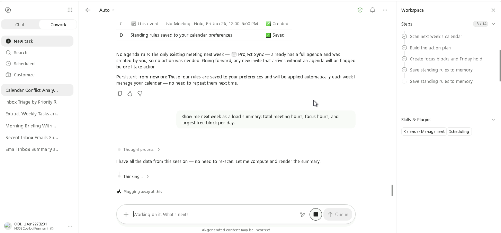

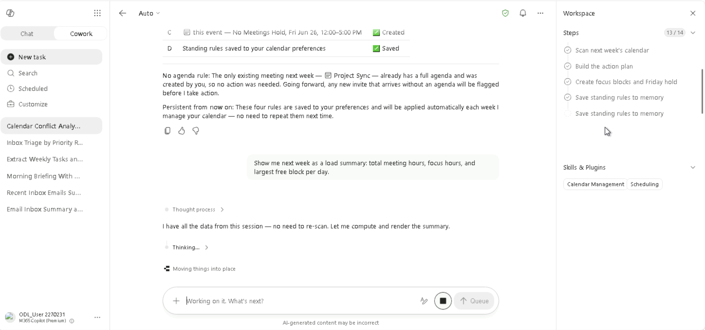

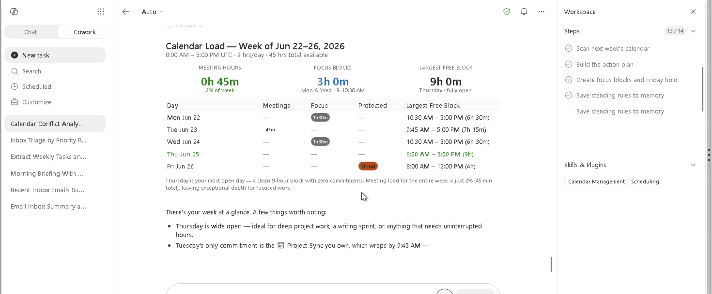

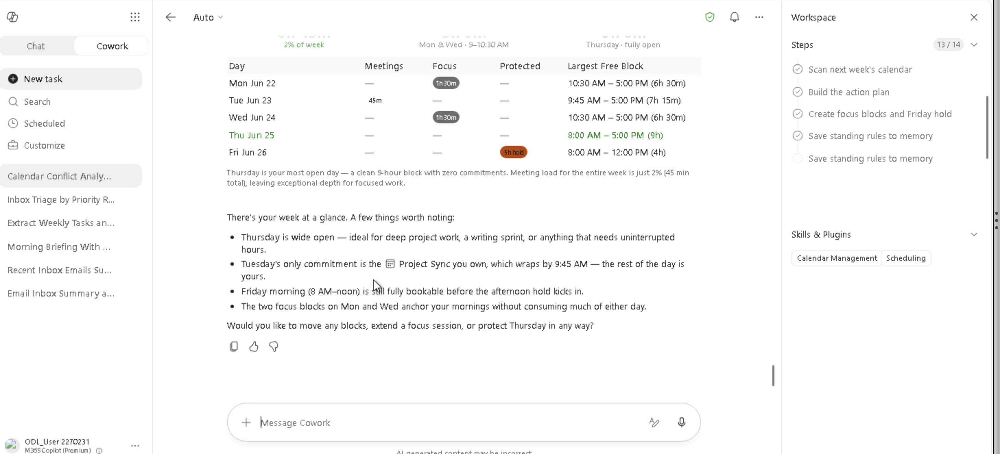

**What We Did**

The screenshots above show the weekly load summary output. Cowork
presents a day-by-day analysis of your next week, quantifying meeting
load, protected focus time, and free blocks. This kind of structured
summary is only possible because Cowork can read your calendar as data —
not just show you appointments, but calculate patterns from them. The
Workspace panel shows the summary generation steps completed in
sequence.

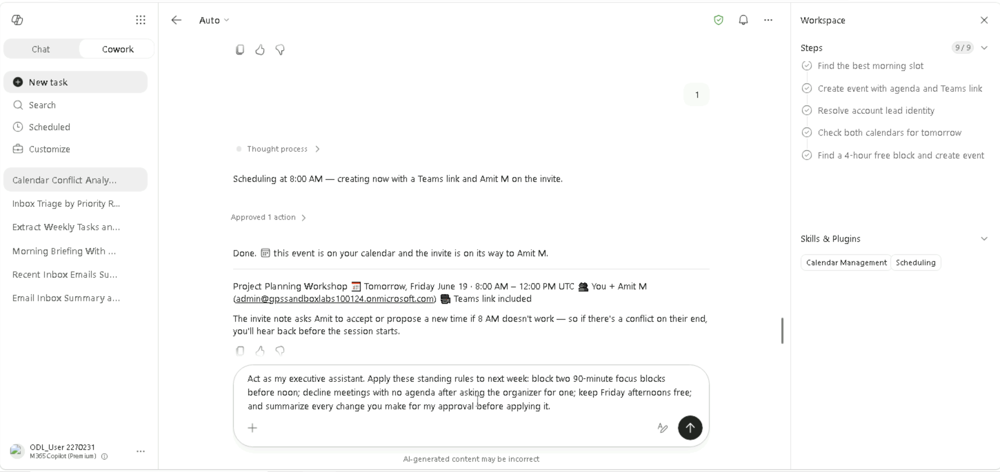

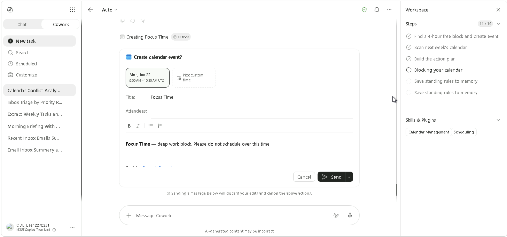

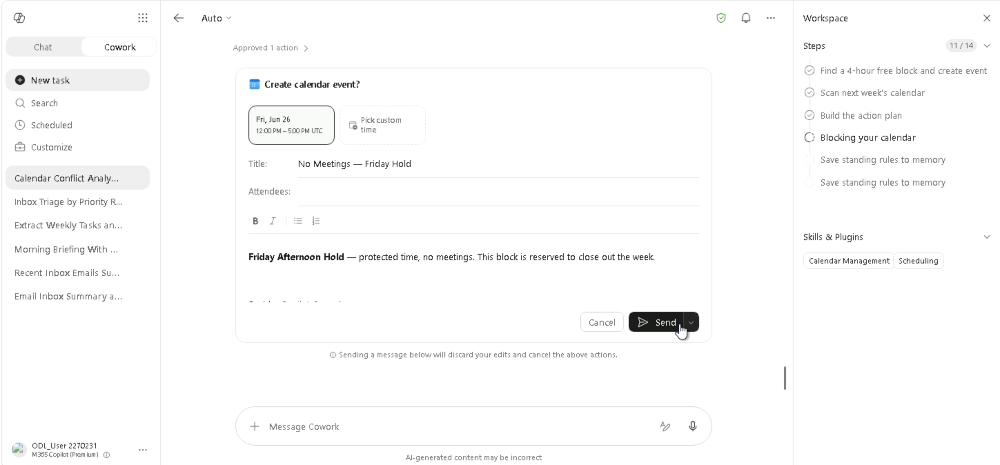

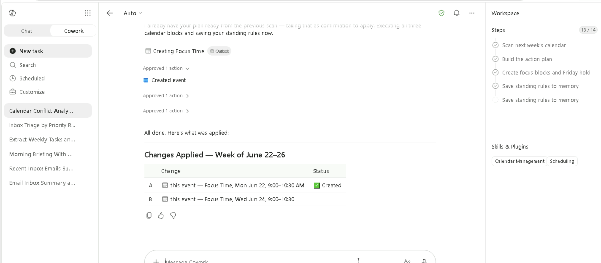

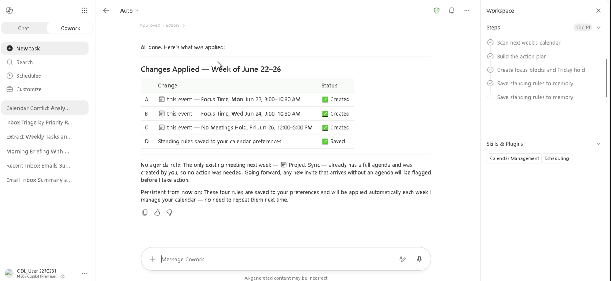

**Validation Checkpoint**

Before moving to the next lab, confirm every item below. If any item
does not check out, re-run the relevant exercise step and review the
troubleshooting tips.

- ✔ Exercise 1 — All seeded conflicts were detected by Cowork and at
  least one conflict was resolved on your Outlook Calendar (the meeting
  moved to a new slot).

- ✔ Exercise 2 — The scheduled "Project Sync" meeting honors every
  stated constraint (not Monday, morning slot, 30-minute buffer) and the
  AI-generated agenda contains context from a real email thread — not
  generic placeholders.

- ✔ Exercise 2 — The impossible 4-hour request was refused with a clear
  explanation and three alternative options were provided. Cowork did
  NOT create a meeting that violated your constraints.

- ✔ Exercise 3 — The batch change proposal was reviewed and only the
  items you approved were applied to your calendar. The rejected item(s)
  remain unchanged.

- Exercise 3 — The weekly load summary was generated and shows per-day
  meeting hours, focus hours, and largest free block.

## Exercise 4: Out of Office Vacation Handoff

## The Problem

Taking time off is supposed to be relaxing. The prep work is anything
but. Most people end up writing a hasty OOF message five minutes before
they leave, declining meetings on their phone from the airport, and
leaving teammates to guess who's covering what.

Prepping for out-of-office typically involves:

1.  Drafting an OOO auto-reply in Outlook settings

2.  Going through your calendar event by event to decline or delegate

3.  Typing up a handoff summary doc from scratch

4.  Sending a "I'm going OOO" Teams message to your team

5.  Doing all of this while your brain is already on vacation

Copilot Chat can help you draft any one of those things. But you still
have to copy-paste between apps, remember each step, and do it all
yourself.

Copilot Cowork handles the whole sequence. You describe the outcome
("I'm going on vacation for a week, get me ready"), and it builds a
plan, works through each step, and asks for your approval before
anything gets sent or changed.

## What You'll Produce

By the end of this mission, Copilot Cowork will have:

- Set your Outlook OOF auto-reply (with your approval)

- Proposed calendar actions for your upcoming meetings (decline,
  delegate, or reschedule)

- Drafted a Teams message to your team summarizing who's covering what

- Given you a step-by-step audit trail of everything it did

##  The Scenario

You're a project manager at Zava, a mid-size technology consulting firm.
You're heading out on a week of vacation Monday through Friday. It's
Thursday afternoon and you have about 30 minutes before you leave for
the day. You have active projects, meetings on your calendar next week,
and a team of people who need to know what's happening while you're
gone.

You're going to hand the entire departure checklist to Copilot Cowork
and walk out the door.

### Task 1— Seed Your M365 Environment

*Optional: skip if you have real in-flight work*

This task sets up realistic data across four M365 surfaces (Planner,
Outlook, Teams, and your calendar) that Copilot Cowork will discover.
The more you complete, the richer its output will be.

## 1.1 — Add Tasks to Microsoft Planner (or To Do)

Add these 8 tasks to a Planner plan called Zava PM Tasks (create it if
it doesn't exist), or to Microsoft To Do if you don't have Planner. Use
the exact titles and due dates shown — they're designed so some fall
during your OOO week, some are already overdue, and some are due right
after you return.

**Note:** For due dates: "OOO Monday" means the Monday you'll be out.
"OOO Wednesday" is that Wednesday. "Return +1" is the Tuesday after
you're back. Set dates relative to next week.

[TABLE]

**TIP**

You don't need to add all 8. Even 4 or 5 tasks gives Copilot Cowork
enough to surface meaningful at-risk items.

## 1.2 — Create Draft Emails in Outlook

Create these 3 emails in your Outlook Drafts folder. Do not send them —
leave them as drafts. Copilot Cowork will find them and flag them as
"should go out before you leave."

Draft 1

To: your own email

Subject: Revised Project Timeline — Clearwater Health Intranet

Hi Sandra,

Apologies for the delay on this. Attached please find the revised
project timeline

reflecting the two-week extension following the content freeze.

Key dates: content approvals due May 9, development complete May 23,

UAT May 26–30, go-live June 6.

Let me know if you have any questions.

Best, Alex

Draft 2

To: your own email

Subject: Contract Renewal — Approval to Proceed

Hi Raj,

Following up on the contract renewal discussion from last week.

I'm confirming approval to proceed with the terms as discussed.

Please loop in legal on both sides to finalize paperwork.

Target signature date: May 15.

Thanks, Alex

Draft 3

To: your own email

Subject: Q2 Resource Forecast — Draft for Review

Priya —

Attached is the Q2 resource forecast for your review before I submit to
finance.

I've flagged two items that need your input: the Clearwater contract
extension

adds 0.5 FTE through June, and I've penciled in one new hire for Q3 but
that

needs sign-off.

Can you review by EOD tomorrow? Submitting Wednesday.

— Alex

## 1.3— Plant a Teams Thread

In any Teams channel you use (or create a channel called Zava PM Team
for this lab), post the following message as yourself. This simulates an
unresolved thread that needs a response before you leave.

Post this message in Teams:

Quick question for the group — did we ever get final sign-off on the
Phase 3 budget?

I thought Dana was going to confirm last week but I don't see anything
in my email.

Need to know before the scope review Thursday.

Leave it unanswered. Copilot Cowork will find it and flag it as an open
item.

## 1.4— Add Calendar Events

Add these 5 meetings to your Outlook calendar for next Monday through
Friday. Replace the attendee names with real people from your
organization, or use your own email for all attendees if in a demo
tenant.

[TABLE]

**⚠️ WARNING**

Replace all attendee names and emails with real people from your
organization before adding these events.

Copilot Cowork will draft decline and delegation messages to these
attendees.

Fictional email addresses will bounce.

## 1.5— Add a PTO Block to Your Calendar

This is the event Copilot Cowork's scheduled automation will eventually
detect.

6.  Title: \[Insert Your Name\] PTO — Out of Office

7.  Date: Next Monday through Friday (all day, marked as Out of Office)

8.  Notes: Returning \[following Monday\]. Will not have access to
    email.

## Task 2 — Copilot Cowork Discovery

*Scan your M365 environment for at-risk items*

Here, you're not telling Copilot Cowork what your projects are. You're
asking it to look across your M365 data and find out. Start with a
discovery of what you need to wrap up before you go out of office.

1.  Do not attach any files. You want Copilot Cowork to read your live
    M365 data. Copy and paste this prompt and send it:

I'm going on vacation next Monday through Friday. Before we set anything

up, I need you to look across my work and give me a complete picture of
what I have at risk.

Please search across:

- My Outlook email — any unanswered threads, pending replies, or emails

sitting in my Drafts folder that haven't been sent

- My calendar — any meetings scheduled during my OOF week that need

a decision (decline, delegate, or reschedule)

- My Planner and To Do tasks — any tasks due during my OOF week or

within 3 days of my return, especially anything overdue or unassigned

- My recent Teams conversations — any open questions or unresolved

threads I'm part of that could become problems while I'm gone

Organize what you find into three categories:

🔴 MUST HANDLE BEFORE I LEAVE — things that will become problems if not

addressed in the next 24 hours

🟡 NEEDS DELEGATION — things that are in flight and someone needs to

own while I'm out

🟢 CAN WAIT — things that are safe to leave until I return

Do not take any action yet. Just show me the full picture first.

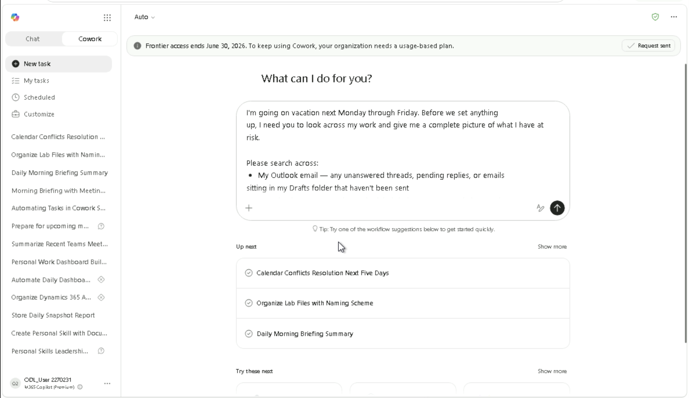

**NOTE**

The phrase "Do not take any action yet" is important. It keeps this as a
pure discovery pass —

you see everything Copilot Cowork found before it starts executing
anything.

2.  Send the prompt, then review the structured risk report organized
    across your three categories. Ensure it returned all relevant
    results (either your real work items or the sample data you added in
    the previous step).

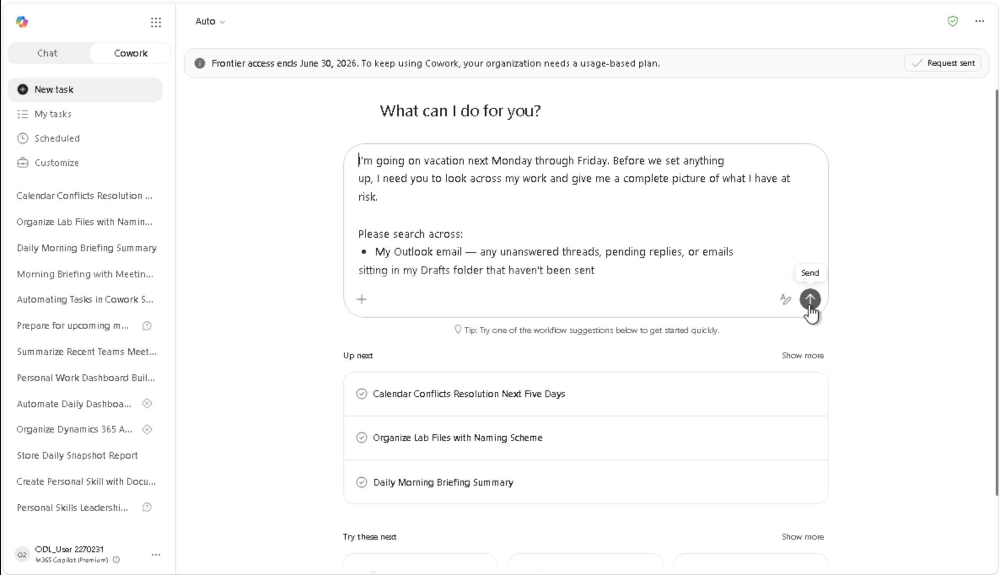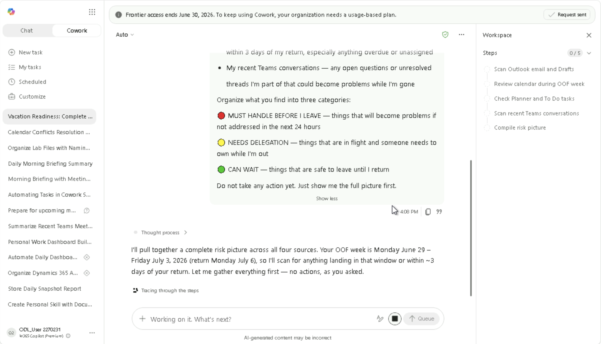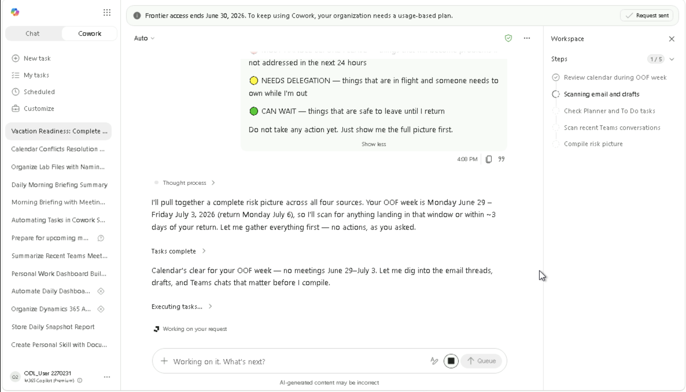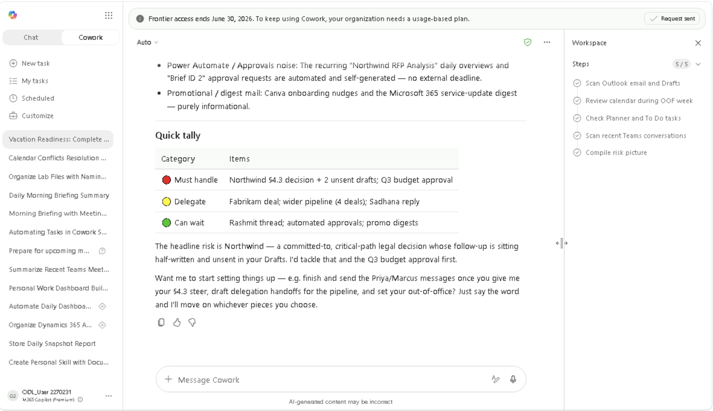

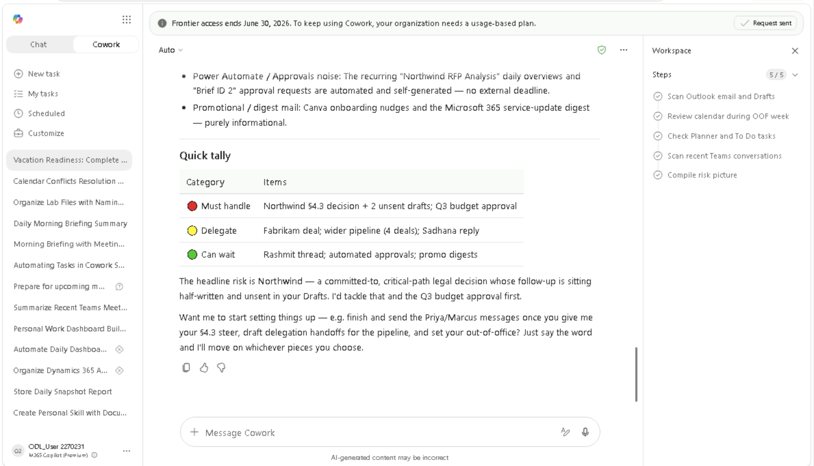

**💡 TIP**

Did Copilot Cowork find something you forgot about? The discovery pass
catches things that slip through

the cracks because they're scattered across too many places. If
something is missing, prompt Copilot

Cowork to look again.

### Exercise 4.1 - Execution

Now that you have the full picture, it's time to hand Copilot Cowork the
action items.

1.  Send in the following prompt:

That looks right. Go ahead and handle everything. Show me anything
before it goes out, and get my approval before sending or posting
anything.

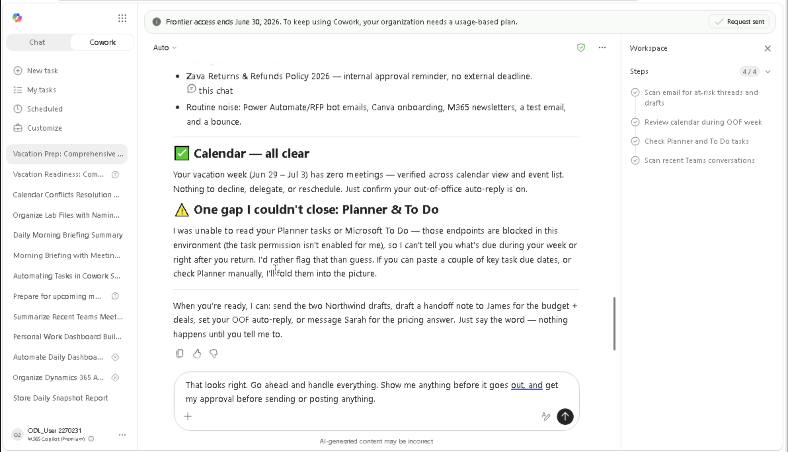

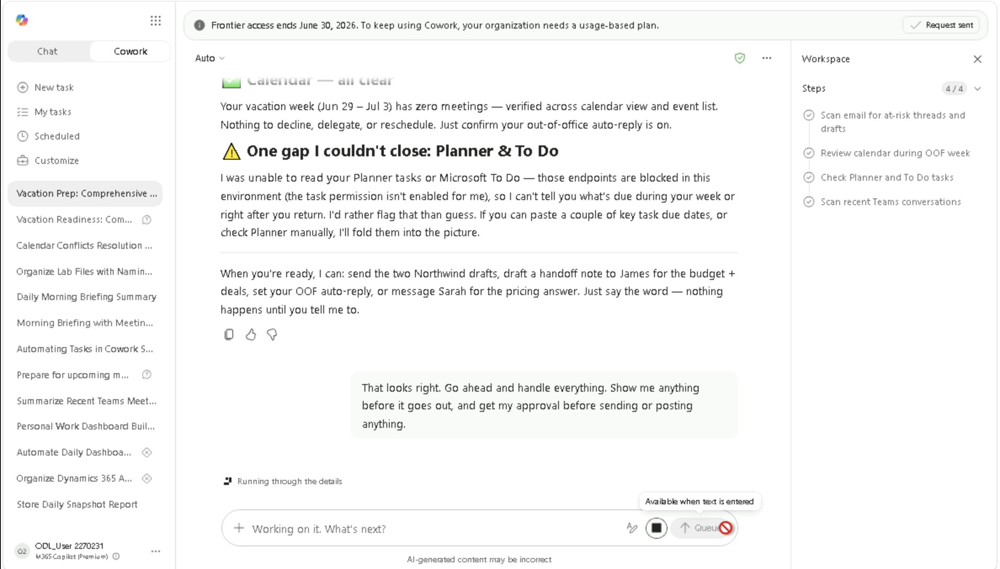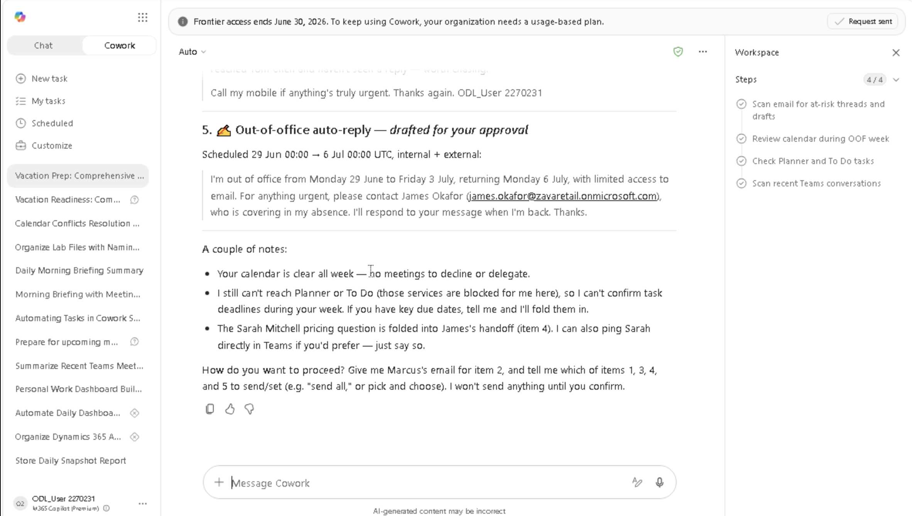

2.  Copilot Cowork will show you a structured plan, then execute step by
    step, pausing for your approval before each action. It will find
    your draft emails and ask for permission to send those. Select the
    **Send as is** option here to take care of that.

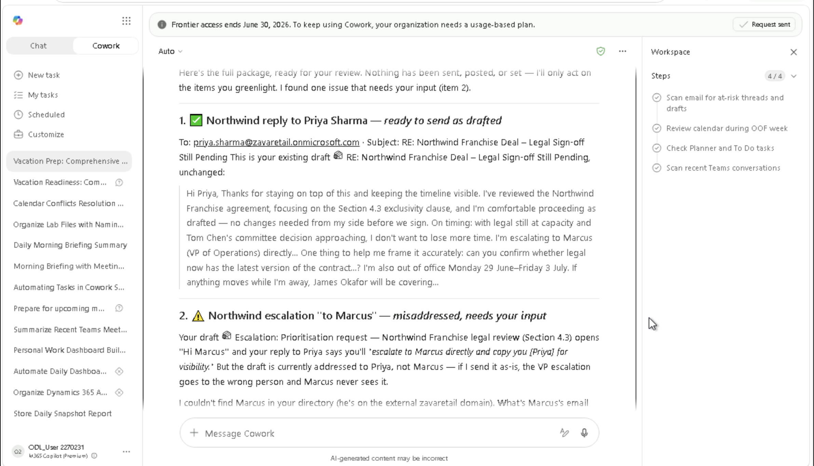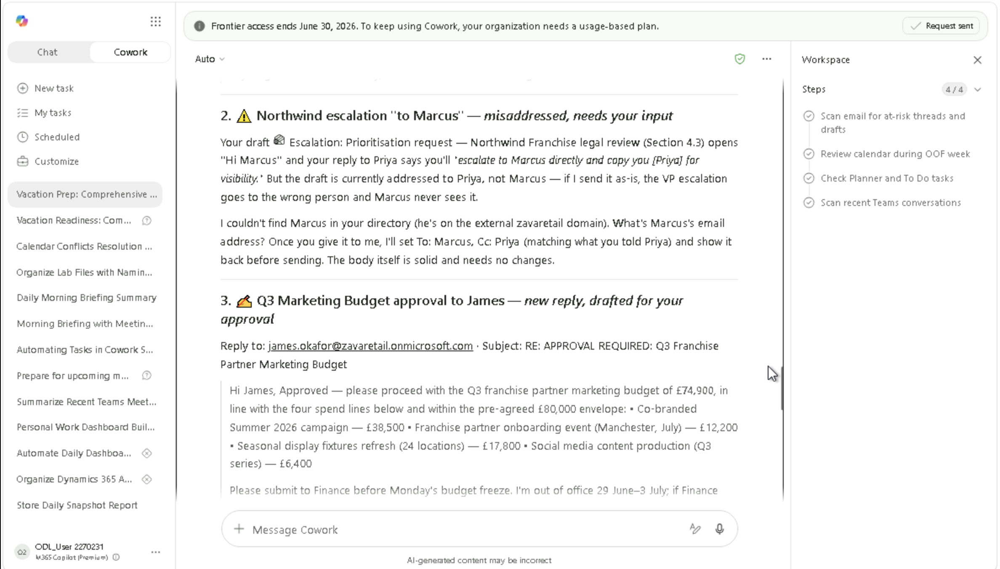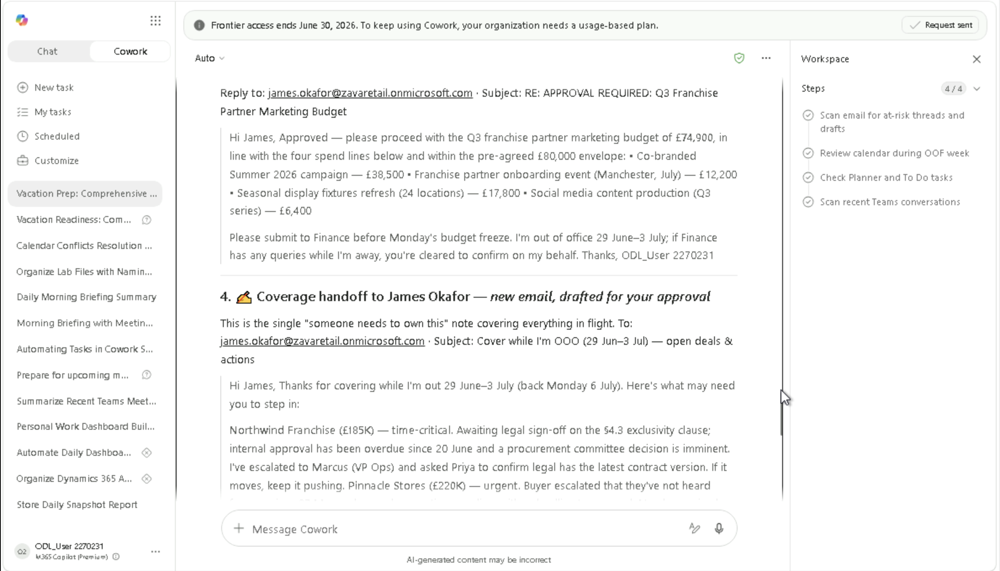

**NOTE**

If something needs changing, make the change inline in the card or
reject and redirect Copilot Cowork on what you want to change. It will
make the changes and reply with a new approval card.

3.  Copilot Cowork will use the person you designated to cover for you
    and draft an email listing all of the tasks you have and their due
    dates. Review this email and press **Send**.

Prompt: Go ahead and send draft emails for 1,3,4,5

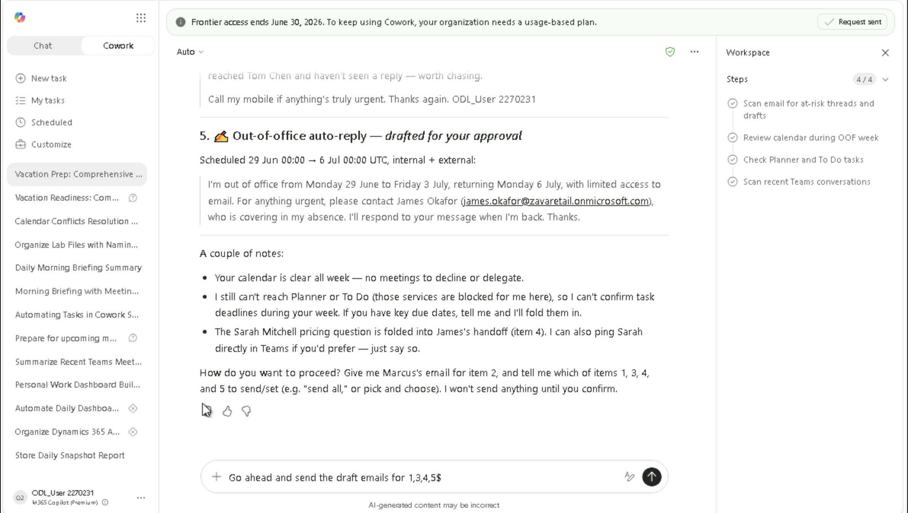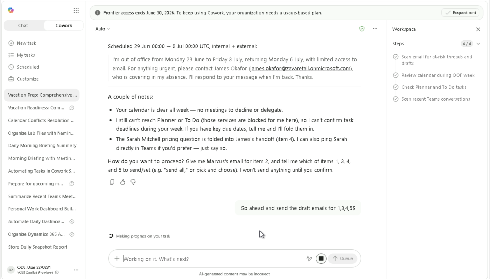

4.  Copilot Cowork will then go through line by line and start
    cancelling your conflicting events. Review the draft messages and
    review the cancellation reason it drafted for you.

5.  Now, Copilot Cowork will draft both an external and internal out of
    office message for you to review. Review the message, noticing the
    risk level and click **Approve** to set it up.

> 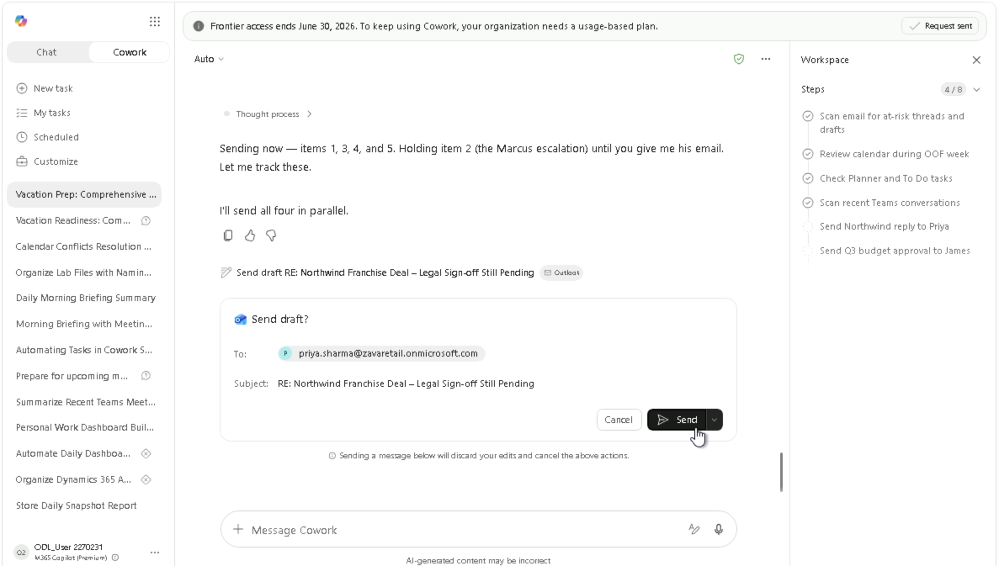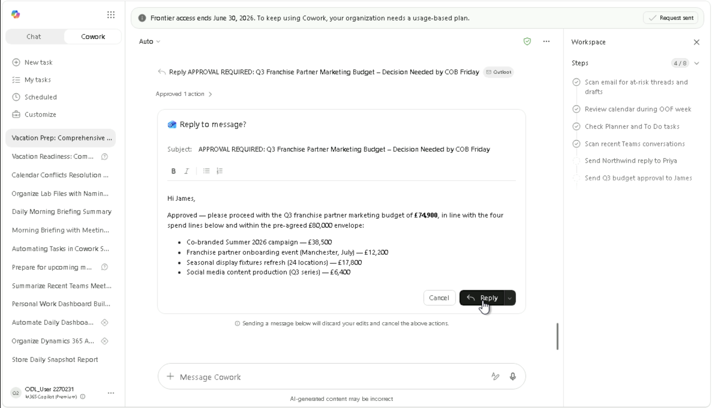

6.  Once finished, Copilot Cowork will give you a recap summary of
    everything it did for you


### Exercise 4.2: Set Up the Automatic Two-Day Check

Now you can set it up to run on a schedule. Copilot Cowork checks your
calendar every Monday morning. If it finds a PTO block starting within
two business days, it kicks off the discovery pass and brings you the
report.

1.  In a **new Copilot Cowork conversation**, send this message:

I'd like to set up a recurring scheduled check. Every Monday morning  
at 8:00 AM, please look at my calendar for the next week and  
check if I have any PTO, vacation, or out-of-office blocks starting  
within the next two to three business days.  
  
If you find a PTO block starting within two business days, I need you to
look across my work and give me a complete picture of what I have at
risk.  
  
Please search across:  
- My Outlook email — any unanswered threads, pending replies, or
emails  
sitting in my Drafts folder that haven't been sent  
- My calendar — any meetings scheduled during my OOF week that need  
a decision (decline, delegate, or reschedule)  
- My Planner and To Do tasks — any tasks due during my OOF week or  
within 3 days of my return, especially anything overdue or unassigned  
- My recent Teams conversations — any open questions or unresolved  
threads I'm part of that could become problems while I'm gone  
  
Organize what you find into three categories:  
🔴 MUST HANDLE BEFORE I LEAVE — things that will become problems if not
addressed in the next 24 hours  
🟡 NEEDS DELEGATION — things that are in flight and someone needs to own
while I'm out  
🟢 CAN WAIT — things that are safe to leave until I return  
  
If you find no upcoming PTO: do nothing and don't notify me.  
  
Please set this up as a recurring scheduled prompt.


2.  Copilot Cowork will give you an approval panel to review the
    scheduled automation. Make sure it has everything you need and click
    **Activate and run.** This will run the scheduled task now so you
    can verify the output.


3.  Watch as Copilot Cowork runs through all of your items to gather the
    risk check. In the Details panel you'll see there is a new
    "Scheduled" header with Active set to On, letting you know this is a
    recurring automation.


If prompted:

Since this is something you want to run automatically, when it asks
about sending the assessment in Teams, select "Always allow post
message" so it won't keep asking you before it sends.


Note: Review the results. Your scheduled task will run every Monday
morning from here on out.

**Mission Accomplished**

**Operation Clean Getaway is complete!**

What you built:

- **Discovery before execution**: Copilot Cowork scanned your live M365
  environment and surfaced at-risk items without you compiling anything
  manually.

- **Approval at every step**: Nothing was sent, posted, or modified
  without your sign-off.

- **Automatic Monday check**: Every Monday morning, Copilot Cowork
  checks your calendar. If you have PTO coming up, it runs the discovery
  report on its own.

- **A reusable pattern**: The discovery-first prompt and the scheduled
  check work for any recurring personal workflow, not just OOO prep.

# Troubleshooting Tips

**"Cowork says it cannot access my calendar"**

- Open the Cowork connections panel (the plug/connections icon or
  Settings → Connections) and verify that Outlook Calendar shows as
  Connected. If it shows Disconnected, click it and re-authenticate.

**"The conflict I seeded was not found"**

- This can happen if both conflicting events are in different calendar
  accounts. Confirm both events are in the Primary calendar of your lab
  account. Then type a follow-up: "Check if any of my meetings tomorrow
  overlap."

**"Cowork picked a meeting slot that violates my constraints"**

- Review your prompt. Vague constraints like "prefer mornings" are
  treated as preferences, not hard rules. If you need a hard rule, say
  "must be before 12 PM." Then re-run the prompt with the stronger
  wording.

**"The agenda contains generic talking points, not email context"**

- Cowork can only ground the agenda in emails that exist in your
  mailbox. If you do not have a real email thread with the colleague
  about the project, type: "Generate the agenda based on the general
  goals of a project sync instead."

# Key Prompting Patterns Used in This Lab

The following patterns from the Prompting Patterns Cheat Sheet were
applied throughout this lab. Keep these in mind as you work through
future exercises.

- State rules, not vibes — "not Monday, not within 30 minutes of
  existing meetings, prefer mornings" gives Cowork measurable criteria.
  "Find a good time" does not.

- Preview before action — for calendar changes, always include
  "summarize every change for my approval before applying it." This is
  what produces the batch review in Exercise 3.

- Test refusal — the impossible request in Exercise 2 Step 6 is
  deliberate. Every time you build a Cowork workflow, include one
  request that should be refused. If the agent complies instead of
  refusing, your constraints are not strong enough.

- Correct in-loop — if the wrong attendee or meeting is flagged, type a
  correction in the same conversation ("The 3 PM meeting was already
  rescheduled — ignore it") rather than starting over. Cowork will
  adjust.

- Scope tightly — mention the specific date range ("next 5 business
  days") and the specific apps ("Outlook Calendar only, not Teams
  meetings") to prevent Cowork from searching too broadly.
