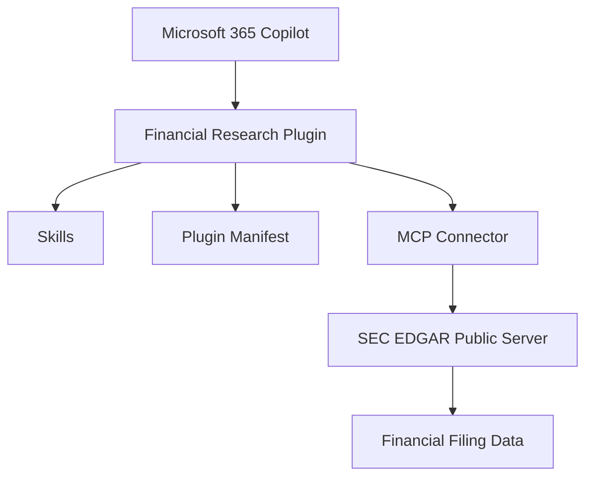
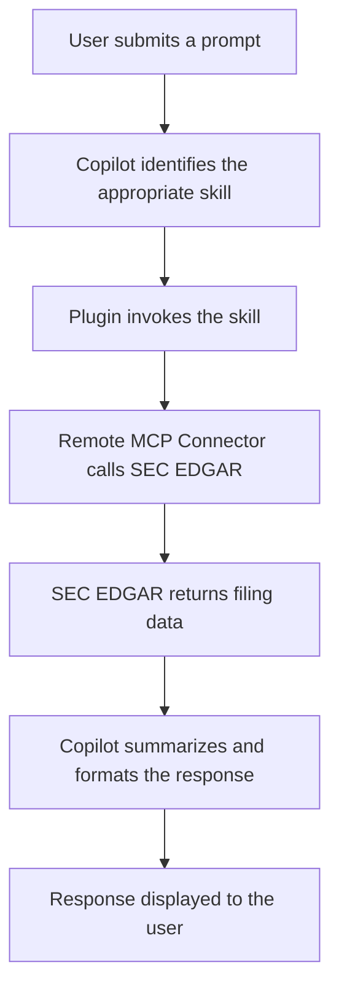

# Lab 8: Build and Publish a Custom Microsoft 365 Copilot Cowork Plugin

Estimated Duration: 20 minutes

## Lab Overview

Microsoft 365 Copilot can be extended using Copilot Cowork Plugins,
enabling organizations to integrate enterprise knowledge, business
processes, and external services directly into Copilot experiences.

In this lab you will build a Financial Research Plugin that extends
Microsoft 365 Copilot with live financial research capabilities by
connecting to the Contoso public repository through a Remote Model
Context Protocol (MCP) Server.

Instead of manually authoring the plugin, you will use a single
structured AI prompt to generate a complete, deployment-ready plugin
package. You will then review the generated assets, validate the
package, publish it through the Microsoft 365 Admin Center, and test the
plugin inside Copilot Cowork.

The build prompt specifies the required Microsoft 365 Unified App
Manifest structure, plugin skills, connector configuration, packaging
rules, validation requirements, and deployment process — so the AI
produces a package that is ready to upload without hand-editing.

> [!NOTE]
> **What is MCP?**
>
> The **Model Context Protocol (MCP)** is an open standard that enables AI assistants to securely connect to external tools and data sources through a standardized interface.
>
> In this lab, the plugin uses a **Remote MCP Server**, which hosts the required tools and retrieves live data from the **SEC EDGAR** service at runtime. This means the plugin does **not** store or bundle the data itself—it queries the remote service whenever a user makes a request, ensuring the information is current.

## Learning Objectives

After completing this lab, you will be able to:

- Launch Microsoft 365 Copilot and enable Copilot Cowork.

- Generate a complete Copilot Cowork plugin package using a structured
  AI prompt.

- Understand the structure of a Microsoft 365 Copilot plugin (manifest,
  skills, connector, icons).

- Review the generated manifest, skills, and connector configuration.

- Validate the plugin package against the devPreview schema before
  deployment.

- Publish the plugin through the Microsoft 365 Admin Center.

- Test plugin functionality inside Microsoft 365 Copilot Cowork using
  natural-language queries.

## Lab Prerequisites

- Microsoft 365 Copilot license (Premium).

- Copilot Cowork enabled for your account.

- Microsoft 365 Administrator (Global Admin or equivalent) permissions.

- Internet access and a modern web browser (Microsoft Edge or Chrome
  recommended).

- Access to Microsoft 365 Copilot or Claude for AI-assisted plugin
  generation.

> [!IMPORTANT]
> **Administrator permissions are required** to upload a custom app through the **Microsoft 365 Admin Center**.
>
> If you are using a **training** or **ODL sandbox**, sign in with the **administrator account** provided for the lab—not your personal Microsoft account.
>
> Without administrator permissions, you will **not** be able to complete **Exercises 5 and 6**.

# **Solution Overview**

## **What Are We Building?**

You will build a Financial Research Plugin for Microsoft 365 Copilot
Cowork. The plugin extends Copilot with specialized financial-research
capabilities using publicly available SEC filing data.

Rather than relying only on Copilot's built-in knowledge, the plugin
connects to a Remote MCP Server that exposes SEC EDGAR data. When a user
asks a financial question, Copilot selects the appropriate skill,
retrieves the required information from the SEC EDGAR service, and
returns a summarized, formatted response.

## **Plugin Architecture**

## Plugin Architecture



## **Plugin Components**

The generated plugin package consists of:

- A Microsoft 365 Unified App Manifest (manifest.json).

- Seven Copilot skills (one SKILL.md per skill folder).

- A single Remote MCP Connector (SEC EDGAR public server).

- Two plugin icons: color.png (192 × 192) and outline.png (32 × 32).

- A single deployment package (ZIP) with manifest.json at the root.

The package follows the Microsoft 365 Unified App Manifest (devPreview)
schema and includes all assets required for deployment.

## **Skills Included in the Plugin**

The plugin contains seven specialized skills that map natural-language
requests to financial-research tasks. Each skill uses the SEC EDGAR MCP
connector to retrieve and summarize public-company information.

## Available Skills

| Skill | Description | Example Prompt |
|-------|-------------|----------------|
| **Company Snapshot** | Retrieves a company's profile, business overview, and key financial information. | `Give me a snapshot of Microsoft.` |
| **Financial Trends** | Analyzes historical revenue, profit, and growth trends over time. | `Show Microsoft's five-year revenue trend.` |
| **Peer Comparison** | Compares two or more public companies using key financial metrics. | `Compare Microsoft and Amazon.` |
| **Risk Factor Analysis** | Reviews risk disclosures from SEC filings and summarizes key risks. | `What risks are listed in Microsoft's latest 10-K?` |
| **Earnings Deep Dive** | Summarizes quarterly earnings reports and highlights business performance. | `Analyze Microsoft's latest earnings.` |
| **Executive Research** | Retrieves executive leadership information and executive compensation details. | `Who is Microsoft's CEO?` |
| **Filing Search** | Searches SEC filings using keywords, phrases, or topics. | `Find filings mentioning Artificial Intelligence.` |

> [!NOTE]
> **Common SEC Filing Types**
>
> - **10-K** – Annual report containing audited financial statements, business overview, and risk factors.
> - **10-Q** – Quarterly report providing financial updates between annual reports.
> - **8-K** – Current report filed to disclose significant business events between regular reporting periods.
> - **DEF 14A** – Proxy statement containing executive compensation, board information, and shareholder voting matters.

## **Plugin Workflow**

The following workflow shows how Microsoft 365 Copilot processes a
financial-research request:

## Request Processing Flow



# **Exercise 1 — Launch Microsoft 365 Copilot and Enable Cowork**

### **Objective**

Verify that Microsoft 365 Copilot and Copilot Cowork are available and
ready for plugin development.

### **Tasks**

1.  Sign in to Microsoft 365 with your Copilot-licensed account.

2.  Launch Microsoft 365 Copilot.

3.  At the top of the Copilot pane, select the Cowork tab (next to
    Chat).


*Figure 1 — The Cowork tab in Microsoft 365 Copilot. Note the New task,
My tasks, Scheduled, and Customize items in the left rail.*

> [!TIP]
> **Chat vs. Copilot Cowork**
>
> - **Chat** is designed for quick questions and conversational interactions.
> - **Copilot Cowork** is the task-oriented, agentic workspace where **skills** and **plugins** execute multi-step workflows.
>
> In this lab, your **Financial Research** plugin runs in **Copilot Cowork**. Before continuing, verify that the **Cowork** tab is selected.

4.  Open the composer menu (the + in the task box) and choose Customize
    to manage skills & plugins.


*Figure 2 — The composer menu. Customize (Manage skills & plugins) is
where installed plugins are enabled.*

5.  Verify you have access to Plugins, Skills, and Agent Builder from
    the Customize screen.


*Figure 3 — The Customize screen showing installed plugins and the
Discover gallery.*

> [!NOTE]
> **If you don't see Copilot Cowork**
>
> Copilot Cowork (sometimes labeled **Frontier**) is enabled on a **per-tenant** and **per-license** basis. If the **Cowork** tab is not available:
>
> 1. Verify that your account has a **Microsoft 365 Copilot Premium** license assigned.
> 2. Confirm that **Copilot Cowork** has been enabled for your Microsoft 365 tenant by an administrator.
>
> After a license is assigned, it may take some time for the **Cowork** experience to become available.

### **Expected Result**

Copilot Cowork is available and ready for plugin development.

# **Exercise 2 — Generate the Plugin Using AI**

Duration: ~20 minutes

### **Objective**

Generate a complete Microsoft 365 Copilot Cowork plugin package using a
single structured AI prompt.

## Task 1 — Start a New AI Session

Open a new chat / task in Microsoft 365 Copilot. Using a fresh session
ensures previous conversations do not influence the generated output.


*Figure 4 — Starting a new task in Cowork. A clean session gives the
most predictable, repeatable output.*

> [!TIP]
> **Why a Fresh Session Matters**
>
> Large language models use the context from earlier messages in a conversation to generate responses. As a result, previous interactions can influence the current task—for example, by reusing an existing GUID, skipping required files, or generating a different folder structure.
>
> Starting with a **new Copilot Cowork session** helps ensure consistent, predictable results that match the steps and screenshots in this lab guide.

## Task 2 — Review the Plugin Generation Prompt

The build prompt instructs the AI to generate a Financial Research
plugin package that includes a Unified App Manifest, seven research
skills, a Remote MCP connector, plugin icons, and a deployment-ready
ZIP. It also defines the required folder structure, manifest schema,
validation rules, packaging process, and deployment guidance.

> [!IMPORTANT]
> **Read the Prompt Before You Run It**
>
> This prompt defines the complete specification for the plugin. Reviewing it before execution will help you verify that the generated output is correct in **Exercise 3**.
>
> Pay particular attention to these common validation requirements:
>
> - **`agentSkills`** and **`agentConnectors`** must be **top-level properties** in the manifest. They must **not** be nested under `copilotAgents`.
> - The manifest must include **`manifestVersion: "devPreview"`** and a valid **`packageName`**.
> - Every **`SKILL.md`** file must define **`metadata.cowork.category`** and **`metadata.cowork.icon`** under the **`metadata`** section.

### **The Complete Build Prompt**

Copy the entire block below exactly as written.
## Plugin Generation Prompt

> [!IMPORTANT]
> Copy the entire prompt below exactly as shown and paste it into a **new Copilot Cowork session**. Do not modify the prompt unless instructed by the lab.

## Plugin Generation Prompt

> [!IMPORTANT]
> Copy the entire prompt below exactly as shown and paste it into a **new Copilot Cowork** session. Do **not** modify the prompt unless instructed by the lab.

```
# Microsoft 365 Copilot Cowork Plugin Generation Prompt
 
Build a Microsoft 365 Copilot Cowork (Frontier) plugin package called
**Financial Research** that:
  - Adds seven SEC EDGAR research skills.
  - Includes one Remote MCP Connector (SEC EDGAR public server).
  - Produces a single ZIP package ready for upload via the
    Microsoft 365 Admin Center.
  - Validates against the Microsoft 365 Unified App Manifest
    (devPreview) schema.
  - Binds to Microsoft 365 Copilot Cowork (not just Microsoft Teams).
 
-------------------------------------------------------------------
Output Path
  Place all source files under:
    output/microsoft-financial-research-tools/
  Place the final ZIP at:
    output/microsoft-financial-research-tools.zip
 
-------------------------------------------------------------------
Package Structure
  microsoft-financial-research-tools/
  |-- manifest.json
  |-- color.png    (192 x 192 RGBA, Microsoft blue background)
  |-- outline.png  (32 x 32 RGBA, transparent bg, white glyph)
  `-- skills/
      |-- company-snapshot/SKILL.md
      |-- financial-trends/SKILL.md
      |-- peer-comparison/SKILL.md
      |-- risk-factor-analysis/SKILL.md
      |-- earnings-deep-dive/SKILL.md
      |-- executive-research/SKILL.md
      `-- filing-search/SKILL.md
 
-------------------------------------------------------------------
manifest.json  (use this canonical structure)
agentSkills and agentConnectors MUST be top-level properties and
MUST NOT be nested under copilotAgents.
 
{
  "$schema": "https://developer.microsoft.com/json-schemas/teams/
             vDevPreview/MicrosoftTeams.schema.json",
  "manifestVersion": "devPreview",
  "version": "1.0.0",
  "id": "<NEW GUID v4>",
  "packageName": "com.microsoft.financial-research-tools",
  "developer": {
    "name": "Microsoft",
    "websiteUrl": "https://www.microsoft.com",
    "privacyUrl": "https://privacy.microsoft.com",
    "termsOfUseUrl": "https://www.microsoft.com/legal/terms-of-use"
  },
  "name": {
    "short": "Financial Research",
    "full": "Microsoft Financial Research Tools"
  },
  "description": {
    "short": "SEC EDGAR research skills for public-company analysis.",
    "full": "Seven skills plus the SEC EDGAR MCP connector for company
            snapshots, financial trends, peer comparison, risk-factor
            analysis, earnings deep dives, executive research, and
            full-text filing search."
  },
  "icons": { "color": "color.png", "outline": "outline.png" },
  "accentColor": "#0078D4",
  "agentSkills": [
    { "folder": "./skills/company-snapshot" },
    { "folder": "./skills/financial-trends" },
    { "folder": "./skills/peer-comparison" },
    { "folder": "./skills/risk-factor-analysis" },
    { "folder": "./skills/earnings-deep-dive" },
    { "folder": "./skills/executive-research" },
    { "folder": "./skills/filing-search" }
  ],
  "agentConnectors": [
    {
      "id": "secedgar",
      "displayName": "SEC EDGAR",
      "description": "Public SEC EDGAR data: company search, filings
        (10-K/10-Q/8-K/DEF 14A), XBRL financials, full-text search.",
      "toolSource": {
        "remoteMcpServer": {
          "mcpServerUrl": "https://secedgar.caseyjhand.com/mcp",
          "authorization": { "type": "None" }
        }
      }
    }
  ],
  "validDomains": [ "secedgar.caseyjhand.com" ]
}
 
-------------------------------------------------------------------
Schema Rules
  - agentSkills and agentConnectors MUST be top-level properties.
  - Do NOT place them under copilotAgents.
  - copilotAgents only accepts declarativeAgents.
  - packageName MUST be included.
  - manifestVersion MUST be "devPreview".
  - Use the Microsoft Teams vDevPreview schema URL.
  - agentConnectors[].toolSource.remoteMcpServer.authorization.type
    MUST be "None".
  - validDomains MUST include: secedgar.caseyjhand.com
  - Generate a new GUID v4 for the id.
 
-------------------------------------------------------------------
SKILL.md Frontmatter  (every skill must use this)
---
name: <kebab-case folder name>
description: |
  <2-4 sentence description>
  Use when the user asks:
  "<trigger phrase 1>"
  "<trigger phrase 2>"
  "<trigger phrase 3>"
license: MIT
metadata:
  author: Microsoft
  version: "1.0"
  cowork.category: Finance
  cowork.icon: <PascalCase Fluent UI icon>
---
# <Display Name>
## What This Skill Does
## When to Use
## Workflow
## Output Format
 
IMPORTANT: cowork.category and cowork.icon MUST be nested under
metadata.
 
-------------------------------------------------------------------
Skills, Fluent icons, and trigger phrases
  company-snapshot   (icon: BuildingBank)
    - snapshot of <ticker>
    - overview of <company>
    - tell me about <company>
  financial-trends   (icon: ChartMultiple)
    - 5-year financials for <company>
    - revenue trend / how has <company> grown
  peer-comparison    (icon: ScaleFill)
    - compare A vs B / benchmark <company>
    - rank companies by revenue
  risk-factor-analysis (icon: ShieldError)
    - what are the risks for <company>
    - risk factors in <company>'s 10-K
  earnings-deep-dive (icon: DocumentBulletList)
    - analyze latest earnings / earnings recap
  executive-research (icon: People)
    - who runs <company> / leadership of <company>
    - executive compensation
  filing-search      (icon: SearchInfo)
    - find filings mentioning <phrase>
    - which companies disclosed <topic>
 
Each skill should invoke these MCP tools:
  - secedgar_company_search
  - secedgar_get_filing
  - secedgar_get_financials
  - secedgar_search_filings
 
-------------------------------------------------------------------
Icons
  color.png   : 192 x 192 RGBA, Microsoft Blue (#0078D4),
                white centered chart/document glyph.
  outline.png : 32 x 32 RGBA, transparent bg, white outline glyph.
  Generate icons using Pillow. Do NOT use external image services.
 
-------------------------------------------------------------------
Packaging
  Use Python's zipfile module.
  Place manifest.json at the ROOT of the ZIP.
  Generate: output/microsoft-financial-research-tools.zip
 
-------------------------------------------------------------------
Validation Checklist
  [ ] manifest.json is at the ZIP root
  [ ] Uses the Microsoft Teams vDevPreview schema
  [ ] manifestVersion = devPreview
  [ ] packageName is present
  [ ] New GUID v4 generated
  [ ] agentSkills is top-level
  [ ] agentConnectors is top-level
  [ ] Every skill folder exists
  [ ] Every SKILL.md contains valid metadata
  [ ] metadata.cowork.category is nested correctly
  [ ] metadata.cowork.icon is nested correctly
  [ ] color.png is 192 x 192
  [ ] outline.png is 32 x 32
  [ ] validDomains contains secedgar.caseyjhand.com
  [ ] ZIP rebuilt after latest edits
 
-------------------------------------------------------------------
Upload
  Upload ONLY through the Microsoft 365 Admin Center:
    Copilot > Agents > All Agents > Upload Agent
  Do NOT upload through the Teams Admin Center (lenient validation
  may register the package as a Teams-only app).
 
-------------------------------------------------------------------
Success Criteria
  - microsoft-financial-research-tools.zip exists.
  - All validation checks pass.
  - The plugin uploads successfully.
  - Supported On displays the Copilot icon.
  - Categories are populated.
  - SHA256 hash of the ZIP is reported.
  - A summary of the generated package is provided.


```

> [!NOTE]
> **Public Demo MCP Endpoint**
>
> This plugin connects to the following public SEC EDGAR MCP server:
>
> `https://secedgar.caseyjhand.com/mcp`
>
> The endpoint is a community-hosted service provided for this lab and **does not require authentication**. The connector is configured with:
>
> - **Authorization Type:** `None`
>
> Because this is a shared public endpoint, you may occasionally experience higher latency or temporary service interruptions. If a request fails, wait a few moments and try again.

## Task 3 — Copy the Complete Prompt

6.  Select the entire prompt above (from the first line to Success
    Criteria).

7.  Paste it into the Cowork task box.


*Figure 5 — Pasting the build prompt into the Cowork composer.*


*Figure 6 — The full prompt in the composer, ready to submit.*

> [!IMPORTANT]
> **Paste the Entire Prompt**
>
> Pasting only part of the plugin specification is the most common cause of an invalid package. An incomplete prompt may result in:
>
> - Missing skills or connectors.
> - An incorrect manifest structure.
> - Omitted packaging or ZIP generation steps.
>
> Before submitting the prompt, verify that:
>
> - The first line is **`# Microsoft 365 Copilot Cowork Plugin Generation Prompt`**.
> - The final section is **`Success Criteria`**.
>
> Only submit the prompt after confirming that the entire specification has been pasted into a **new Copilot Cowork** session.

## Task 4 — Generate the Plugin

8.  Submit the prompt and let Cowork work through the task. It will
    scaffold the folders, then write files step by step.


*Figure 7 — Cowork begins the task and lays out its plan of steps in the
Workspace panel.*


*Figure 8 — Cowork scaffolds the package directories and prepares to
write the manifest.*

Cowork auto-generates the GUID (the unique plugin id) as part of writing
the manifest.


*Figure 9 — Cowork generating the manifest and reporting the newly
created GUID v4.*

Observe Cowork generating the seven skills defined in the prompt.


*Figure 10 — Cowork authoring the seven SKILL.md files.*


*Figure 11 — The seven skills being written in a single batch.*

Analyze and understand a generated SKILL.md file — note the frontmatter
(name, description, license, and nested metadata) followed by the What /
When / Workflow / Output sections.


*Figure 12 — A generated SKILL.md file. Confirm cowork.category and
cowork.icon are nested under metadata.*

Observe Cowork generating the PNG icons, the JSON manifest, the SKILL.md
files, and finally the complete ZIP package.


*Figure 13 — Cowork generating color.png and outline.png, then packaging
everything into the ZIP.*

> [!TIP]
> **Watch the Workspace / Steps Panel**
>
> The **Workspace** panel on the right displays the progress of each task as Copilot Cowork builds the plugin. Use it as a live checklist and verify that each step completes successfully before proceeding.
>
> Typical steps include:
>
> - Scaffolding the project structure
> - Creating the `manifest.json` file
> - Generating the seven skill folders and `SKILL.md` files
> - Creating the plugin icons
> - Validating the package
> - Building the final ZIP package
>
> Before continuing, confirm that every step in the **Workspace** panel shows a **Completed** status.

Click the … (more options) on the output item and select Open in
OneDrive to review the files that were created.


*Figure 14 — Opening the generated output in OneDrive from the
more-options menu.*


*Figure 15 — The package summary and file tree reported by Cowork
(manifest, icons, and seven skills).*

### **Expected Result**

Cowork produces a complete, deployment-ready plugin ZIP
(microsoft-financial-research-tools.zip) containing the manifest, seven
skills, connector configuration, and both icons.

# Exercise 3 — Review the Generated Plugin

### **Objective**

Inspect the generated assets and confirm the package structure,
manifest, skills, connector, and icons are correct before validating and
publishing.

9.  From the right-hand Workspace panel, locate the Output folder and
    select the … (more options).


*Figure 16 — The Output section listing outline.png, color.png, the ZIP,
SKILL.md files, and manifest.json.*

10. Choose Open in OneDrive to review the generated ZIP package.


*Figure 17 — Selecting Open in OneDrive for the generated package.*


*Figure 18 — The package opened in OneDrive.*

11. Download the folder / ZIP to your local device.


*Figure 19 — Downloading the package to the local device.*

12. Confirm the download completed successfully.


*Figure 20 — The completed download in the browser's Downloads list.*

### **Review the Package Contents**

Extract the ZIP and review each item in turn.

- Folder structure — the root contains manifest.json, color.png,
  outline.png, and a skills/ folder.


*Figure 21 — The extracted folder: manifest.json, color.png,
outline.png, and skills/.*

- manifest.json — open it and confirm the schema, manifestVersion,
  packageName, id (GUID), agentSkills, agentConnectors, and
  validDomains.


*Figure 22 — manifest.json in the file listing.*


*Figure 23 — The manifest contents. Verify agentSkills and
agentConnectors are top-level, not nested.*

> [!IMPORTANT]
> **Verify the Manifest Structure**
>
> Before publishing the plugin, open **`manifest.json`** in a text editor and confirm that all of the following requirements are met:
>
> - **`$schema`** points to the **Microsoft Teams vDevPreview** schema URL.
> - **`manifestVersion`** is set to **`"devPreview"`** and **`packageName`** is present.
> - **`id`** contains a valid, newly generated **GUID v4**.
> - **`agentSkills`** and **`agentConnectors`** are defined as **top-level properties** and are **not** nested under `copilotAgents`.
> - The connector's **`authorization.type`** is set to **`"None"`**.
> - **`validDomains`** includes **`secedgar.caseyjhand.com`**.

- Skills — all seven skills exist, each in its own folder under skills/.


*Figure 24 — The skills/ folder with all seven skill directories.*

- Open each skill folder and review its SKILL.md file.


*Figure 25 — A single skill folder containing its SKILL.md file.*

- Icons — review color.png and outline.png.


*Figure 26 — color.png and outline.png listed alongside the manifest and
skills.*


*Figure 27 — color.png opened: a 192 × 192 white chart glyph on
Microsoft blue.*


*Figure 28 — outline.png opened: a 32 × 32 white outline glyph on a
transparent background.*

> [!NOTE]
> **Why Two Icons?**
>
> The plugin package includes two icon files, each serving a different purpose in Microsoft 365:
>
> - **`color.png`** – A **192 × 192** full-color icon displayed in app galleries, search results, and information cards.
> - **`outline.png`** – A **32 × 32** monochrome icon used in compact user interface elements such as toolbars, navigation menus, and the skills list.
>
> Both icons are **required** by the Microsoft 365 Unified App Manifest. During package validation, the icons are checked to ensure they exist and match the required dimensions:
>
> - **`color.png`** – **192 × 192** pixels
> - **`outline.png`** – **32 × 32** pixels

- MCP connector — confirm the SEC EDGAR connector is present with the
  correct remote MCP server URL and “None” authorization.

Verify the manifest and skill metadata follow the required structure:
top-level agentSkills and agentConnectors, and correctly nested
metadata.cowork.category and metadata.cowork.icon fields.

# Exercise 4 — Validate the Plugin

### **Objective**

Use the validation checklist from the build prompt to confirm the
package is correct before deployment.

Work through each item and confirm it passes:

- manifest.json is at the ZIP root.

- Uses the Microsoft Teams vDevPreview schema.

- manifestVersion = devPreview.

- packageName is present.

- A new GUID v4 was generated for id.

- agentSkills is a top-level property.

- agentConnectors is a top-level property.

- All seven skill folders exist, each with a valid SKILL.md.

- metadata.cowork.category and metadata.cowork.icon are nested
  correctly.

- color.png is 192 × 192 and outline.png is 32 × 32.

- validDomains contains secedgar.caseyjhand.com.

- The ZIP was rebuilt after the latest edits.


*Figure 29 — Reviewing the package against the validation checklist.*


*Figure 30 — The per-skill summary (skill name and what each one does)
confirms all seven are present.*

> [!IMPORTANT]
> **Rebuild the ZIP After Every Change**
>
> If you modify **any** file after creating the ZIP package (for example, updating `manifest.json` or a `SKILL.md` file), you **must** rebuild the ZIP before uploading it.
>
> The **Microsoft 365 Admin Center** validates the **ZIP package** that you upload—not the individual files in your project folder. Uploading an outdated ZIP will publish the previous, uncorrected version of the plugin.

> [!TIP]
> **Common Validation Failures**
>
> - **Manifest is not valid** – Typically caused by:
>   - `agentSkills` or `agentConnectors` being nested under `copilotAgents`
>   - `manifestVersion` not set to `devPreview`
> - **Icons rejected** – The icon files have incorrect dimensions or are not in **RGBA PNG** format.
> - **Skill ignored** – `cowork.category` or `cowork.icon` is defined at the top level instead of under the `metadata` section in `SKILL.md`.
> - **Registered as a Teams-only app** – The package was uploaded through the **Teams Admin Center** instead of the **Microsoft 365 Admin Center**.

# Exercise 5 — Publish the Plugin

### **Objective**

Upload and deploy the validated plugin through the Microsoft 365 Admin
Center.

13. Navigate to the Microsoft 365 Admin Center at
    https://admin.cloud.microsoft.


*Figure 31 — The Microsoft 365 Admin Center home page.*

14. In the left navigation, open Settings.


*Figure 32 — Expanding Settings in the Admin Center navigation.*

15. Select Integrated apps from the Settings menu.


*Figure 33 — Choosing Integrated apps.*


*Figure 34 — The Integrated apps page listing deployed apps.*

16. Scroll down and click Upload custom apps.


*Figure 35 — The Upload custom apps action on the Integrated apps page.*

17. For App type, select Teams app.


*Figure 36 — Selecting the app type (Teams app) in the Deploy New App
wizard.*

> [!NOTE]
> **Why Select "Teams app"?**
>
> Although you are deploying a **Microsoft 365 Copilot Cowork** plugin, the package uses the **Microsoft 365 Unified App Manifest** and is uploaded through the **Teams app** option in the **Microsoft 365 Admin Center**.
>
> This is the expected deployment workflow. Selecting **Teams app** in the upload wizard and publishing the package through the **Microsoft 365 Admin Center** (rather than the **Teams Admin Center**) ensures that the plugin is registered correctly as a **Copilot Cowork** plugin.

18. Click Choose File, then browse and select the ZIP
    (microsoft-financial-research-tools.zip).


*Figure 37 — The Upload manifest file step with Choose File.*


*Figure 38 — Selecting the ZIP from the local Downloads folder.*

19. Click Open to upload the ZIP. Uploading and validation may take a
    few seconds.


*Figure 39 — “Uploading and validating…” shown while the manifest is
checked.*

20. Wait for the “Manifest file validated” confirmation, then click
    Next.


*Figure 40 — The green “Manifest file validated” confirmation.*


*Figure 41 — Validation complete; Next is enabled.*

21. On the Apps to deploy / Configuration screen, review the app details
    and click Next.


*Figure 42 — The Financial Research app recognized, with its description
shown.*

22. On the Add users screen, choose who should get the plugin, then
    click Next.

- Just me (the ODL / admin user) — recommended for this lab.

- All users.

- Specific users or groups.


*Figure 43 — Assigning users. “Just me” or “All users” is fine for a lab
tenant.*

> [!TIP]
> **Assign to Yourself First**
>
> For a lab, proof of concept, or pilot deployment, assign the plugin to **Just me** (or a small test group) before making it broadly available.
>
> This approach allows you to:
>
> - Verify that the plugin installs and functions correctly.
> - Validate the skills, connector, and user experience in a controlled environment.
> - Resolve any issues before expanding the assignment to a larger audience.
>
> After successful testing, you can assign the plugin to **All users** or additional groups from the app's details page in the **Microsoft 365 Admin Center**.

23. On Review and finish deployment, confirm the settings and click
    Finish deployment.


*Figure 44 — The Review and finish deployment screen.*

24. Deployment runs; this may take a few seconds.


*Figure 45 — “Deployment in progress…”*

25. Confirm the plugin deployed successfully.


*Figure 46 — “Deployment completed” — Financial Research shows as
Deployed.*

26. Click View this deployment to review the result.


*Figure 47 — Selecting View this deployment.*


*Figure 48 — The Financial Research app details: Status OK, type App
(Custom app).*

27. Review the Users and Security & Compliance tabs.


*Figure 49 — The Users tab showing the assignment.*


*Figure 50 — The Security & Compliance tab (publisher attestation
info).*

> [!NOTE]
> **Deployment Propagation**
>
> After the plugin is successfully deployed, it may take a few minutes before it becomes available to assigned users in **Copilot Cowork**.
>
> If the plugin does not appear immediately:
>
> - Wait a few minutes for the deployment to propagate.
> - Refresh the **Copilot Cowork** page or restart the application.
> - Verify that the plugin has been assigned to your account or user group in the **Microsoft 365 Admin Center**.

### **Enable the Plugin in Cowork**

28. Open Copilot Cowork and go to Customize. Enable the Financial
    Research plugin.


*Figure 51 — The Financial Research plugin in the Customize list, ready
to enable.*

29. If you don't see it under Installed plugins, scroll down, click Show
    more, then search for and select Financial Research.


*Figure 52 — Finding Financial Research in the plugin gallery via Show
more.*

30. Click the Financial Research plugin and click Install from the
    top-right of the panel.


*Figure 53 — The plugin detail panel with the Install button and the SEC
EDGAR MCP server and skills listed.*

31. Confirm your custom Financial Research plugin is now enabled.


*Figure 54 — Financial Research enabled (toggle on) in Customize.*

> [!IMPORTANT]
> **Publisher Not Verified**
>
> Because this plugin is a **custom side-loaded app**, Copilot may display a **Publisher not verified** or **Missing attestation** notice on the **Security & Compliance** tab.
>
> This behavior is **expected** for lab and development packages and **does not affect the plugin's functionality**.
>
> For production environments, only deploy applications from **verified publishers** that have completed the appropriate validation and attestation process. Avoid distributing unverified custom apps broadly across a production tenant.

# **Exercise 6 — Test the Plugin**

Duration: ~15 minutes

### **Objective**

Confirm the plugin works end to end: the correct skill is triggered, the
MCP connector retrieves SEC EDGAR data, and Copilot returns a
well-formatted response.

Open Microsoft 365 Copilot Cowork and test the following prompts:

- Give me a snapshot of Microsoft.

- Compare Microsoft and Google.

- Analyze Microsoft's latest earnings.

- Show Microsoft's five-year revenue trend.

- What are Microsoft's risk factors?

- Who is Microsoft's CEO?

- Find filings mentioning Artificial Intelligence.

32. Navigate back to the Cowork chat window.


*Figure 55 — The Financial Research plugin detail, confirming the SEC
EDGAR connector and skills.*

33. Click New task.


*Figure 56 — Starting a New task in Cowork.*

34. Enter one of the prompts above (for example, “Give me a snapshot of
    Microsoft”).


*Figure 57 — Typing the snapshot prompt in the composer.*

35. Observe the Financial Research (company-snapshot) skill being
    triggered.


*Figure 58 — Cowork selects the company-snapshot skill and begins
resolving the company.*


*Figure 59 — The skill runs the SEC EDGAR company search and pulls
recent filings (10-K, 10-Q, 8-K).*

Verify that the appropriate skill is invoked, the MCP connector
retrieves SEC EDGAR data, and Copilot returns a well-formatted response.

> [!NOTE]
> **How Ticker Resolution Works**
>
> The plugin uses a company's **ticker symbol** to retrieve information from the **SEC EDGAR** service.
>
> For example, when you ask:
>
> ```text
> Give me a snapshot of Microsoft.
> ```
>
> The plugin first resolves the company name to its stock ticker:
>
> ```text
> Microsoft → MSFT
> ```
>
> It then uses the **MSFT** ticker to query the **SEC EDGAR MCP** server and retrieve the company's public filings and financial data, including:
>
> - Company profile
> - **10-K** annual reports
> - **10-Q** quarterly reports
> - **8-K** current reports
> - Financial statements
> - Executive leadership information
> - Risk factors
>
> This ticker resolution process allows the plugin to locate the correct company and retrieve the latest publicly available information from the SEC EDGAR database.


*Figure 60 — The formatted Microsoft snapshot: recent filings and
year-over-year revenue and net-income figures.*


*Figure 61 — The completed snapshot response, sourced live from SEC
EDGAR filings.*

> [!TIP]
> **Try the Other Six Skills**
>
> Run the remaining sample prompts to test each of the available skills:
>
> - **Peer Comparison**
> - **Financial Trends**
> - **Risk Factor Analysis**
> - **Executive Research**
> - **Earnings Deep Dive**
> - **Filing Search**
>
> After each prompt, watch the **Workspace** panel under **Skills & Plugins** to verify that the correct skill is activated. Each skill should invoke the **SEC EDGAR** connector and return a structured response based on the requested financial data.

> [!IMPORTANT]
> **Public Data Only**
>
> This plugin retrieves **publicly available SEC EDGAR filings** and is intended for research and demonstration purposes only. It **does not** provide financial, investment, or legal advice.
>
> The information returned reflects the **most recent filings available** from the SEC EDGAR database at the time of the request and may not represent real-time market conditions. Always verify important figures and disclosures against the original SEC filing before making business or investment decisions.
### **Expected Result**

Each prompt triggers the matching skill, the SEC EDGAR MCP connector
returns filing data, and Copilot presents a clear, formatted answer.

# Lab Summary

In this lab, you:

- Enabled Microsoft 365 Copilot Cowork.

- Generated a complete Financial Research plugin package using a single
  structured AI prompt.

- Reviewed the generated manifest, seven skills, connector, and icons.

- Validated the package against the devPreview schema.

- Published the plugin through the Microsoft 365 Admin Center.

- Enabled and tested the plugin in Copilot Cowork using natural-language
  financial queries backed by live SEC EDGAR data.

## **Key Takeaways**

- Copilot plugins are just a manifest + skills + connector packaged as a
  ZIP — the structure is what matters, not hand-written code.

- A well-specified prompt can generate a deployment-ready package, but
  you must still review and validate the output.

- The manifest shape (top-level agentSkills / agentConnectors,
  devPreview version, nested cowork metadata) is the single biggest
  source of upload failures.

- Remote MCP connectors let a plugin pull live external data without
  bundling it, keeping the package small and always current.

## Troubleshooting Reference

> [!TIP]
> **Try the Other Six Skills**
>
> Run the remaining sample prompts to test each of the available skills:
>
> - **Peer Comparison**
> - **Financial Trends**
> - **Risk Factor Analysis**
> - **Executive Research**
> - **Earnings Deep Dive**
> - **Filing Search**
>
> After each prompt, watch the **Workspace** panel under **Skills & Plugins** to verify that the correct skill is activated. Each skill should invoke the **SEC EDGAR** connector and return a structured response based on the requested financial data.

> [!IMPORTANT]
> **Public Data Only**
>
> This plugin retrieves **publicly available SEC EDGAR filings** and is intended for research and demonstration purposes only. It **does not** provide financial, investment, or legal advice.
>
> The information returned reflects the **most recent filings available** from the SEC EDGAR database at the time of the request and may not represent real-time market conditions. Always verify important figures and disclosures against the original SEC filing before making business or investment decisions.
